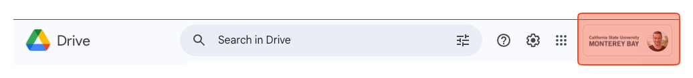
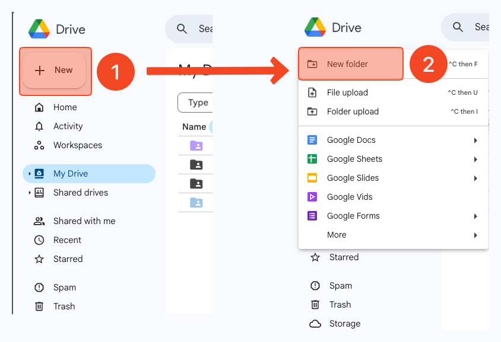
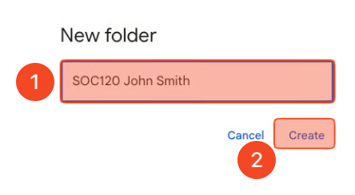
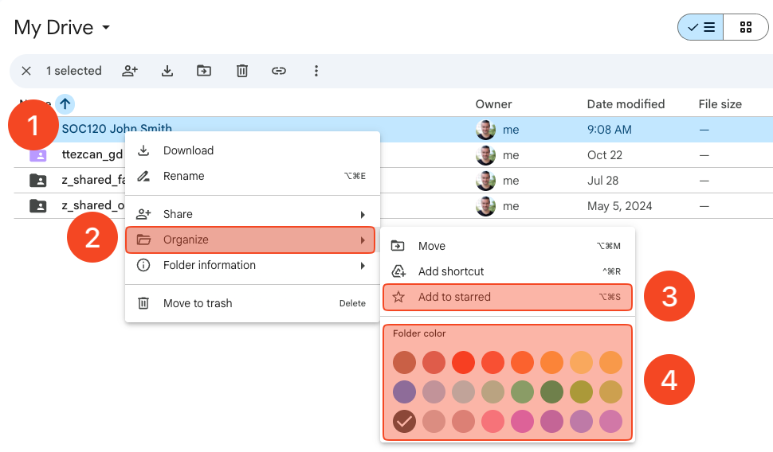
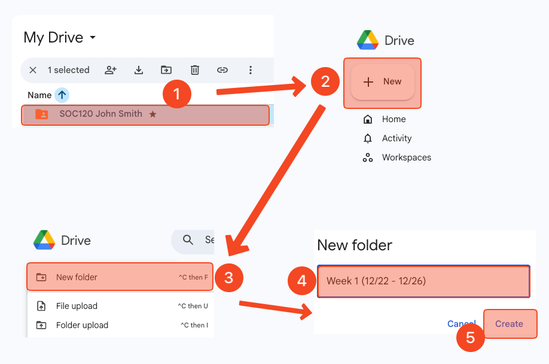
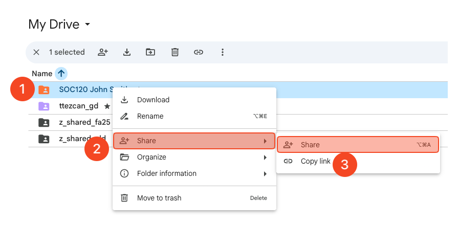
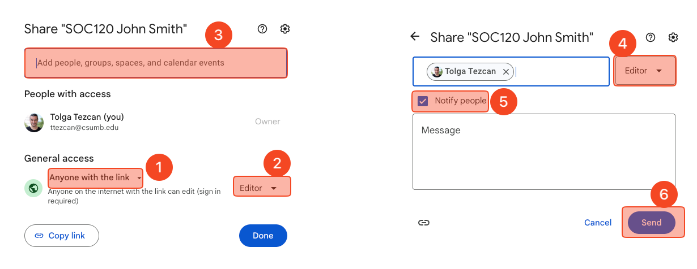
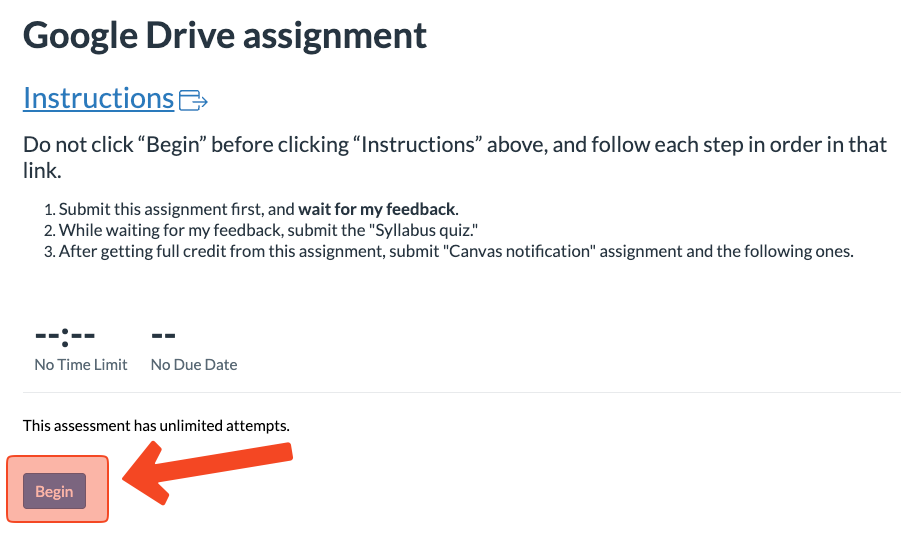
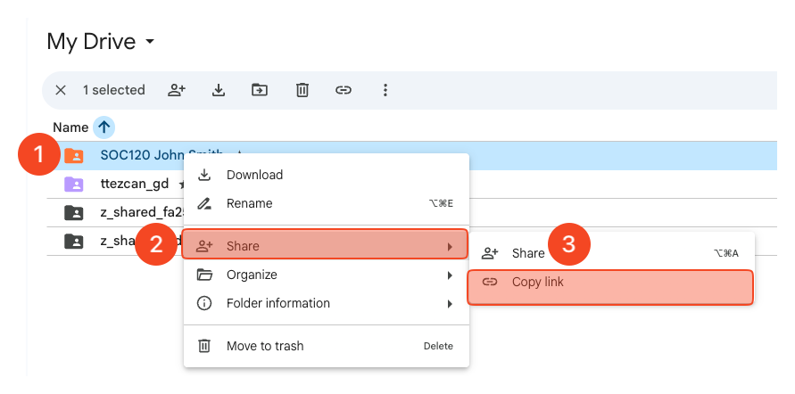

# Google Drive assignment


Students **cannot** continue this class without getting full credit from this assignment (unlimited attempts).&#x20;

Each submission without getting full credit from this assignment will result in no credit for the following assignments (Except the "Syllabus quiz" and "Introduce yourself" - _if you see under  Week 1 module_).



<mark style="color:red;">Use</mark> [<mark style="color:red;">Google Chrome</mark>](https://www.google.com/chrome/) or any Chromium based browser ([Brave](https://brave.com/download/), [Opera](https://www.opera.com/download), [Edge](https://www.microsoft.com/en-us/edge), etc.)  for this class.

Safari and other browsers are not fully compatible with Google Drive and Canvas.



We will rely heavily on Google Drive and Google Docs in this course.&#x20;

The purpose of this assignment is to create your Google Drive Class Folder.&#x20;

All your class files will be stored on Google Drive Class Folder and will be submitted to Canvas from there using Google Drive LTI 1.3).


## Assignment video

The video below shows how to complete this assignment from start to finish.&#x20;

> **Do not** submit this assignment <mark style="color:red;">without</mark> watching the video and read the instructions together.



## Assignment instructions


If you are a repeating student, delete or rename your previous Google Drive class folder, such as "SOC120 John Smith old"

[Instructions: How to rename a folder](https://ttezcan.gitbook.io/lectures/all-lectures-and-labs/guidelines-and-rubrics/how-to-rename-a-file-and-folder-in-google-drive#rename-a-folder)




### Creating a folder

Go to [https://drive.google.com/drive](https://drive.google.com/drive) and make sure you log in with your CSUMB account, **NOT** your personal Gmail account.&#x20;

<figure><figcaption></figcaption></figure>

1. On the main page of Google Drive, click “+ New”&#x20;
2. Click “New folder.”

<figure><figcaption></figcaption></figure>



### Naming the folder

1. Type the code of **THIS** class and your name and last name.&#x20;
   1. For example, “SOC120 Angel Garcia”, “SOC399 John Smith”.
      1. Check [https://csumb.edu/oasis/](https://csumb.edu/oasis/) to see which class you are enrolled in.
      2. No space in the class code. It must be SOC120, **not** SOC 120.
      3. **DO NOT** type the section, such as SOC120-90, SOC399-91.
2. &#x20;Click “Create.”&#x20;

<figure><figcaption></figcaption></figure>



### Add to starred and choose a color

1. Right click on the folder you just created. This is your Google Drive class folder.
2. Click “Organize.”&#x20;
3. Click “Add to Starred.”
4. Right click on the folder you just created again <mark style="color:red;">➜</mark> “Organize” <mark style="color:red;">➜</mark> Choose a color you like under “Folder color.”

<figure><figcaption></figcaption></figure>



### Creating subfolder for each week

1. Double click on your Google Drive class folder and open it.
2. Click “+ New.”&#x20;
3. Click “New folder.”
4.  Paste the folder names (see below) one by one. **Do not type**.&#x20;

    1. Copy (control or cmd + C)&#x20;
    2. Paste (control or cmd + V).

    <mark style="color:red;">**Note:**</mark> Depending on the semester, you may see 4, 8, or 17 Week names below. You need to repeat this 4 times if you see 4 week names; 8 times if you see 8 week names; 17 times if you see 17 week names below:

    * Week 1 (12/22 - 12/26)
    * Week 2 (12/29 - 01/02)
    * Week 3 (01/05 - 01/09)
    * Week 4 (01/12 - 01/16)
5. Click "Create" after pasting each Week name.

<figure><figcaption></figcaption></figure>



### Sharing the Google Drive class folder with me

1. Right click on the folder you just created one more time
2. Click “Share.”
3. Click “Share” again.&#x20;

<figure><figcaption></figcaption></figure>

1. Choose “Anyone with the link” under the “General access.” It's "Restricted" by default.
2. Choose "Editor." It's "Viewer" by default.
3. Type my email address:
   1. &#x20;[ttezcan@csumb.edu](mailto:ttezcan@csumb.edu)
4. Make sure you see "Editor."
5. Make sure "Notify people" is checked.
6. Click "Send."

<figure><figcaption></figcaption></figure>



### Submission to Canvas

Click on "\[gr] Google Drive assignment (must be submitted first)" under the "Week 1" Module on Canvas.

Click "Begin."

<figure><figcaption></figcaption></figure>

1. Right click on your Google Drive class folder.
2. Click "Share."
3. Click "Copy link."

<figure><figcaption></figcaption></figure>

1. Paste (control or cmd + V) the link you copied from the step above.
2. Click "Submit."

<figure><figcaption></figcaption></figure>



### Waiting for my feedback

After the submission, you need to wait for my feedback.&#x20;

Each submission without getting full credit from this assignment will result in no credit for the following assignments (Except the "Syllabus quiz" and "Introduce yourself" - _if you see under Week 1 module_).



