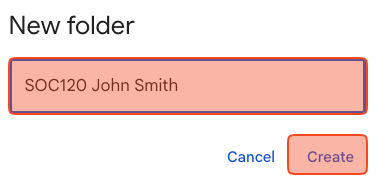

# Google Drive assignment


## Students cannot continue this class without getting full credit from this assignment (unlimited attempts). Each submission without getting full credit from this assignment will result in a 20% deduction for the following assignments.



## <mark style="color:red;">Use</mark> [<mark style="color:red;">Google Chrome</mark>](https://www.google.com/chrome/) or any Chromium based browser ([Brave](https://brave.com/download/), [Opera](https://www.opera.com/download), [Edge](https://www.microsoft.com/en-us/edge), etc.)  Safari and other browsers are not fully compatible with Google Drive and Canvas.



## We will rely heavily on Google Drive and Google Docs in this course. The purpose of this assignment is to create your Google Drive Class Folder. All your class files will be stored on Google Drive Class Folder and will be submitted to Canvas from there using Google Drive LTI 1.3)


## Assignment instructions



Go to [https://drive.google.com/drive](https://drive.google.com/drive) and make sure you log in with your CSUMB account, **NOT** your personal Gmail account.&#x20;

On the main page of Google Drive, click “+ New” and “New folder”

<figure><figcaption></figcaption></figure>



Type the code of THIS class and your name and last name.&#x20;

For example, “SOC120 Angel Garcia”, “SOC399 John Smith.” Click “Create.”&#x20;

No space in the class code. It must be SOC120, **not** SOC 120.

**DO NOT** type the section, such as SOC120-2, SOC399-90.

Check [https://csumb.edu/oasis/](https://csumb.edu/oasis/) to see which class you are enrolled in.

<figure><figcaption></figcaption></figure>



Right click on the folder you just created > “Organize” > “Add to Starred.”

Right click on the folder you just created again > “Organize” > choose a color you like under “Folder color.”

<figure><figcaption></figcaption></figure>


