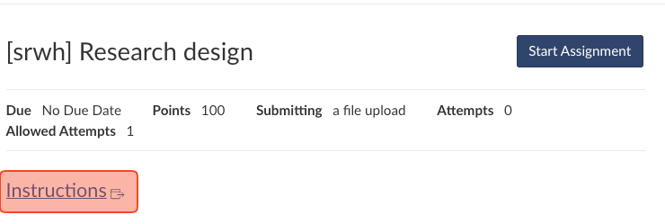
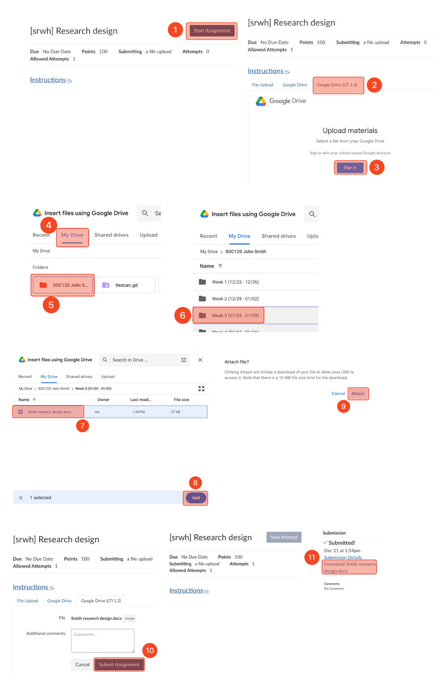

# How to submit an assignment


### This guideline shows how to submit an assignment with:

1. Video instructions
2. Textual instructions
3. Screenshot instructions

Follow the one you prefer.


### <mark style="color:orange;">**Video instructions**</mark>



### <mark style="color:orange;">**Textual instructions**</mark>

1. Make sure you are signed in and see your CSUMB Google profile on the top right:
2. Click “File” <mark style="color:red;">➜</mark> “Make a copy.”
3. Rename the file name.&#x20;
   1. Delete the “Copy of” part.&#x20;
   2. It must be “your last name and the name of the assignment.”&#x20;
      1. For example, “Smith Research design.” (otherwise -5).&#x20;
   3. If there is a mistake, rename the file [\[How to rename a file and folder in Google Drive\]](https://ttezcan.gitbook.io/lectures/all-lectures-and-labs/guidelines-and-rubrics/how-to-rename-a-file-and-folder-in-google-drive).
4.  Click the box under "Folder."

    1. Click "Starred."
    2. Choose your Google Drive class folder.
       1. Do not click "Select" but click the arrow (or double click).
    3. Choose the relevant week subfolder (otherwise no credit).

    Note: If there's a mistake, the assignment will be graded with 10% deduction when the file is moved to the relevant week's subfolder and "moved" is typed in the Canvas comment section of the assignment [\[How to move a file in Google Drive\]](https://ttezcan.gitbook.io/lectures/all-lectures-and-labs/guidelines-and-rubrics/how-to-move-a-file-in-google-drive).
5. Complete the assignment.
6. Before the submission, make sure the file is under the relevant week subfolder. Otherwise, move it [\[How to make sure it's in the correct subfolder\]](https://ttezcan.gitbook.io/lectures/all-lectures-and-labs/guidelines-and-rubrics/how-to-move-a-file-in-google-drive).
7. To submit this assignment, click “Start Assignment” on Canvas <mark style="color:red;">➜</mark> Choose Google Drive (LTI 1.3) (Make sure you log in with your CSUMB credentials) <mark style="color:red;">➜</mark> “Select file” <mark style="color:red;">➜</mark> “MY DRIVE” <mark style="color:red;">➜</mark> "Starred" <mark style="color:red;">➜</mark> Your class folder <mark style="color:red;">➜</mark> Relevant week <mark style="color:red;">➜</mark> Assignment file <mark style="color:red;">➜</mark> “Add” <mark style="color:red;">➜</mark> “Attach” <mark style="color:red;">➜</mark> “Submit Assignment.”
8. Click "Submission details" on the next screen on Canvas right after the submission to make sure you submitted the correct document.

### <mark style="color:orange;">**Screenshots instructions**</mark>

Click on "Instructions."

<figure><figcaption></figcaption></figure>

1. Click “File”&#x20;
2. Click “Make a copy.”
3. Delete the “Copy of” part.
4. Add your last name to the beginning of the filename. <mark style="color:red;">**DO NOT CLICK**</mark> “Make a copy" at this screen.
   1. Click the box under "Folder."
5. Click "Starred."
6. Find your class Google Drive folder. <mark style="color:red;">**DO NOT CLICK**</mark> “Select" at this screen.&#x20;
7. Click the arrow.
8. Find the relevant weekly folder. <mark style="color:red;">**DO NOT CLICK**</mark> “Select" at this screen.&#x20;
9. Click the arrow.
10. Click "Make a copy."

<figure><figcaption></figcaption></figure>

1. Click "Start Assignment"
2. Choose "Google Drive (LTI 1.3)"
3. Sign in with your CSUMB account.
4. Choose "My Drive."
5. Choose your Google Drive class folder.
6. Choose the relevant weekly subfolder.
7. Choose the assignment.
8. Click "Add."
9. Click "Attach."
10. Click "Submit Assignment."
11. Click "Download" the assignment to make sure you submitted the correct file.

<figure><figcaption></figcaption></figure>
