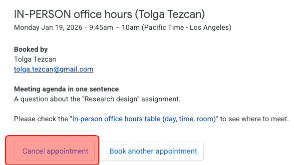
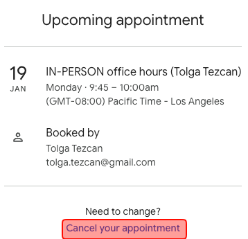

# In-person office hours

## <mark style="color:orange;">**Scheduling an IN-PERSON meeting**</mark> 

1. Check the day, time, room table below.
2. ​[Click this link to schedule an IN-PERSON meeting](https://calendar.app.google/yLvvKZFGcN2ydt4WA)​
3. Choose a 15-min time slot. Book the next time slot if we need more than 15 minutes.
4. Type your first and last name, CSUMB email address, and the meeting agenda in one sentence.
5. Click Book.

## <mark style="color:orange;">IN-PERSON office hours table (day, time, room)</mark> 

In-person office hours: before/after classes or my office\*

| (1) Monday      | 9:45 - 10:00 am - (CAHSS 1102)   |
| --------------- | -------------------------------- |
| (2) Monday      | 11:15 - 11:30 am - (CAHSS 1102)  |
| (3) Monday      | 1:45 - 2:00 pm - (CAHSS 1102)    |
| (4) Monday      | 3:15 - 3:30 pm - (CAHSS 1102)    |
| (5) Monday      | 3:30 - 3:45 pm - (CAHSS 2306)\*  |
| ​(6) Monday     | ​3:45 - 4:00 pm - (CAHSS 2306)\* |
| (7) Monday      | 4:00 - 4:15 pm - CAHSS (2306)\*  |
| (8) Monday      | 4:15 - 4:30 pm - CAHSS (2306)\*  |
| ​               | ​                                |
| (9) Wednesday   | 9:45 - 10:00 am - (CAHSS 1102)   |
| (10) Wednesday  | 11:15 - 11:30 am - (CAHSS 1102)  |
| ​(11) Wednesday | ​1:45 - 2:00 pm - (CAHSS 1102)   |
| (12) Wednesday  | 3:15 - 3:30 pm - (CAHSS 1102)    |
| (13) Wednesday  | 3:30 - 3:45 pm - (CAHSS 2306)\*  |
| (14) Wednesday  | ​3:45 - 4:00 pm - (CAHSS 2306)\* |
| (15) Wednesday  | 4:00 - 4:15 pm - CAHSS (2306)\*  |
| ​(16) Wednesday | ​4:15 - 4:30 pm - CAHSS (2306)\* |

## <mark style="color:orange;">**Cancelling a meeting**</mark>



### Check your inbox

You receive an email for the appointment.

1. Click "Cancel appointment."

<figure><figcaption></figcaption></figure>



### The first dialogue box

1. Click "Cancel your appointment."

<figure><figcaption></figcaption></figure>



### The second dialogue box

1. Click "Confirm."

<figure><figcaption></figcaption></figure>


