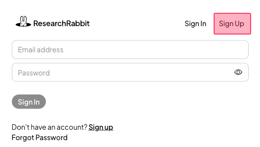
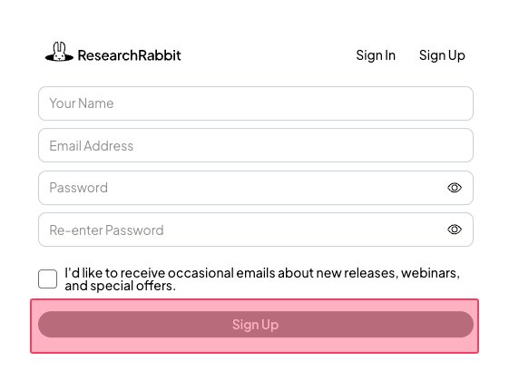
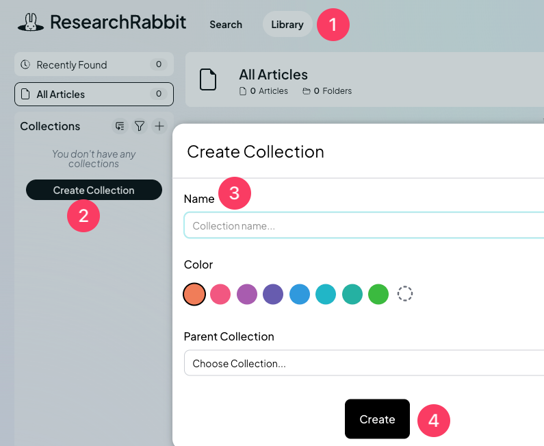
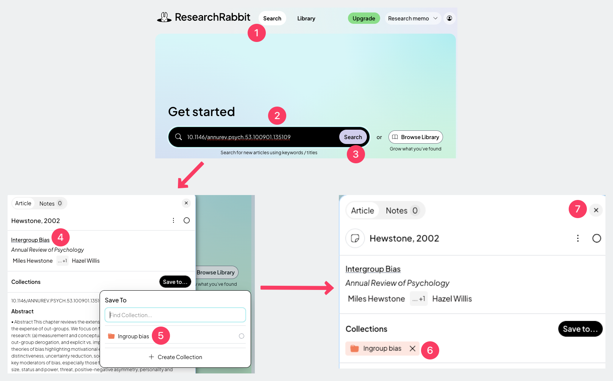

# ResearchRabbit: Literature discovery engine

## Definition

**ResearchRabbit** is a literature discovery engine that helps to find <mark style="color:red;">relevant academic papers</mark>. It uses algorithms to suggest relevant academic papers based on user-selected papers.

When we enter a couple of articles to ResearchRabbit, it analyzes their citation patterns, recommend related research based on our interests, and provide a literature network diagram.

Use the "Free version." Do not use the "Paid" option.

## Website

[**researchrabbitapp.com**](https://researchrabbitapp.com/)

## Sign up, create a project and a collection



### Sign up

<figure><figcaption></figcaption></figure>



### Complete the four fields

<figure><figcaption></figcaption></figure>

Your name, school email address, password, re-enter password. Then, click "Sign up."



### Create a project

1. Type the project name: Research memo
2. Click "Start using ResearchRabbit"

<figure><figcaption></figcaption></figure>



### Create a collection

<figure><figcaption></figcaption></figure>

1. Click "Library" on the main website
2. Click "Create Collection"
3. Type the collection name. For example, if your research relates to ingroup bias, type "Ingroup bias." You can type your dependent variable here.
4. Click "Create"



## Adding articles to the collection



### Add the first article

<figure><figcaption></figcaption></figure>

1. Click "Search" on the main website.
2. Paste the DOI number (starting with "10") of the first article.
   1. [**\[How to find DOI?\]**](https://ttezcan.gitbook.io/lectures/all-lectures-and-labs/guidelines-and-rubrics/citation-chaining-procedure#how-to-find-doi)
3. Click "Search."
4. Click on the link and make sure it's a peer-reviewed journal article.
   1. [**\[How to determine peer-reviewed journal articles?\]**](https://ttezcan.gitbook.io/lectures/all-lectures-and-labs/guidelines-and-rubrics/how-to-determine-peer-reviewed-journal-articles)
5. Click on the collection name you created.
6. Make sure you see your collection name in the next dialoge box.
7. Close the pane.




###




## Paste the DOI

3. As soon as we click "Submit" above, we will see the following dialog box. Paste the DOI of the top choice annual review article(s) and click “Add Directly”
   1. [**\[How to find DOI?\]**](https://ttezcan.gitbook.io/lectures/all-lectures-and-labs/guidelines-and-rubrics/citation-chaining-procedure#how-to-find-doi)

<figure><figcaption></figcaption></figure>

## Create the collection and share it

4. Click the three dots next to “Untitled Collection.”

<figure><figcaption></figcaption></figure>

5. Click “Rename” and Type the main topic.

<figure><figcaption></figcaption></figure>

6. Type my email address, [ttezcan@csumb.edu](mailto:ttezcan@csumb.edu), under “EMAIL” and click “Invite”

## Add articles (DOI) found through citation chaining (a)

7. We will add the three articles we found through [**citation chaining**](https://ttezcan.gitbook.io/lectures/all-lectures-and-labs/guidelines-and-rubrics/citation-chaining-procedure) one by one.
   1. First, click “Add Papers”
   2. Paste the [DOI (the most preferable way) ](https://ttezcan.gitbook.io/lectures/all-lectures-and-labs/guidelines-and-rubrics/citation-chaining-procedure#how-to-find-doi)of the top choice annual review article and click “Add Directly”
   3. If we paste the title of the articles instead, it will take a bit longer (See the next section).

<figure><figcaption></figcaption></figure>

## Add articles (TITLE) found through citation chaining (b)

7.  We will add the three articles we found through [**citation chaining**](https://ttezcan.gitbook.io/lectures/all-lectures-and-labs/guidelines-and-rubrics/citation-chaining-procedure) one by one.

    1. First, click “Add Papers”
    2. Paste the title of the article and click “Search.”
    3. Choose “All Subject Areas.”

    <figure><figcaption></figcaption></figure>

Finally, click “Add to Collection.”

<figure><figcaption></figcaption></figure>

## The view from added articles

8. We click "Similar Work" to see the literature network.

<figure><figcaption></figcaption></figure>

## The literature network

As soon as we click "Similar Work" above, we will see the literature network.

<mark style="color:green;">Green articles:</mark> Our annual review article and three articles we found through citation chaining.

<mark style="color:blue;">Blue articles:</mark> Relevant articles that ResearchRabbit suggests.

9. All the relevant articles are on the left side and also on the diagram.
10. Click the <mark style="color:blue;">blue circles</mark> (the ones closer to the <mark style="color:green;">green ones</mark>). They are the most relevant ones.
11. Find and download the peer-reviewed journal articles indicated by <mark style="color:blue;">blue circles</mark>.&#x20;
    1. [**\[How to find articles\]**](https://ttezcan.gitbook.io/lectures/all-lectures-and-labs/guidelines-and-rubrics/citation-chaining-procedure#how-to-find-articles)

<figure><figcaption></figcaption></figure>

12. We should only use peer-reviewed journal articles.
    1. [**\[How to determine peer-reviewed journal articles?\]**](https://ttezcan.gitbook.io/lectures/all-lectures-and-labs/guidelines-and-rubrics/how-to-determine-peer-reviewed-journal-articles)

## Even more relevant literature network

13. **We will a**dd the <mark style="color:blue;">blue circle articles</mark> to our collection to make our literature network analysis even stronger.

Our collection includes

* One Annual Review article (<mark style="color:green;">Green circle</mark>), and&#x20;
* Three articles found using citation chaining (<mark style="color:green;">Green circle</mark>),

Every time we click on a <mark style="color:blue;">blue circle article,</mark>  we add them to our collection. We click on Esses (1998) and "Add to: _our collection name."_

<figure><figcaption></figcaption></figure>

Every time we add a new article to our literature network, we go back and click “Similar Work” again. We will repeat this process 10 times, until we see 14 <mark style="color:green;">Green circles</mark>:&#x20;

* 1 annual review article
* 3 articles found through citation chaining
* 10 articles that ResearchRabbit suggested and we added to our collection

<figure><figcaption></figcaption></figure>
