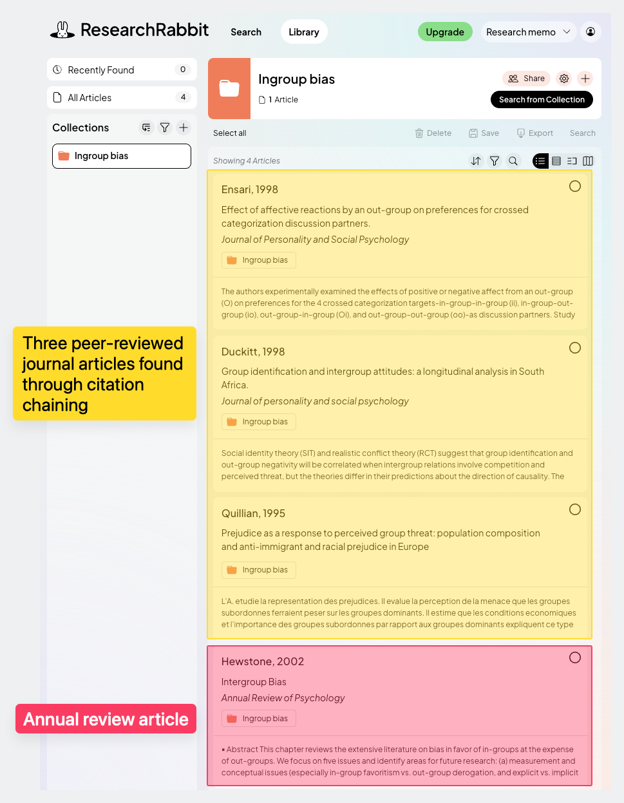
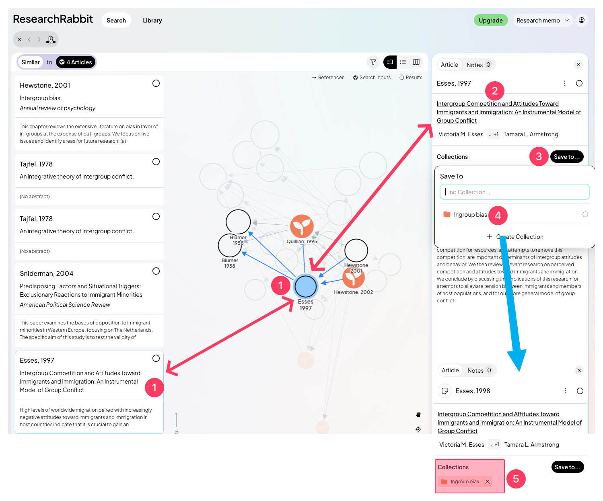
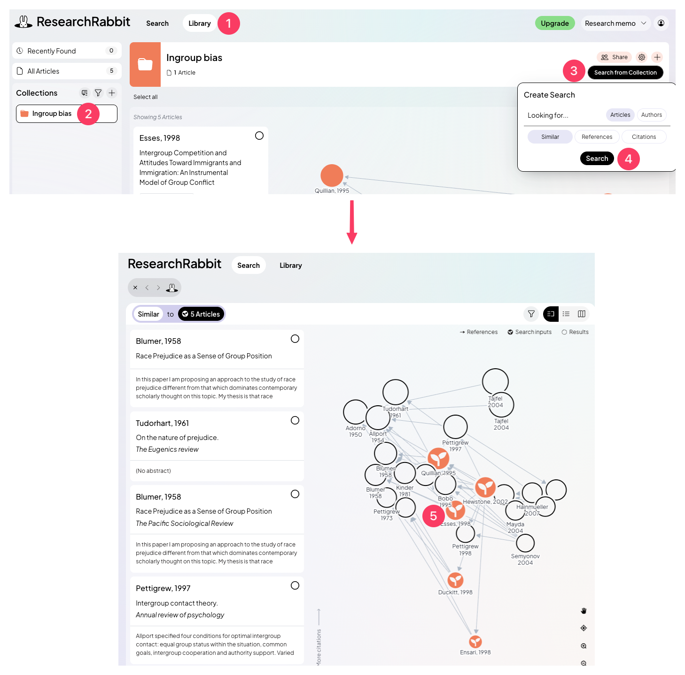
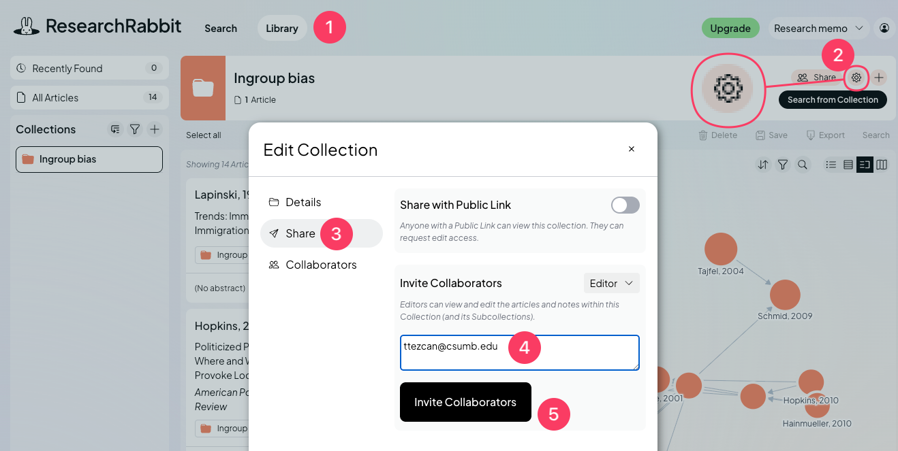

# ResearchRabbit: Literature discovery engine

## Definition

**ResearchRabbit** is a literature discovery engine that helps to find <mark style="color:red;">relevant academic papers</mark>. It uses algorithms to suggest relevant academic papers based on user-selected papers.

When we enter a couple of articles to ResearchRabbit, it analyzes their citation patterns, recommend related research based on our interests, and provide a literature network diagram.


Use the "Free version."&#x20;

Do not use the "Paid" option.


## Website

[**researchrabbitapp.com**](https://researchrabbitapp.com/)

## Sign up, create a project and a collection



### Sign up

<figure><figcaption></figcaption></figure>



### Complete the four fields

<figure><figcaption></figcaption></figure>

Your name, school email address, password, re-enter password. Then, click "Sign up."



### Create a project

<figure><figcaption></figcaption></figure>

1. Type the project name: Research memo
2. Click "Start using ResearchRabbit."



### Create a collection

<figure><figcaption></figcaption></figure>

1. Click "Library" on the main website
2. Click "Create Collection"
3. Type the collection name. For example, if your research relates to ingroup bias, type "Ingroup bias." You can type your dependent variable here.
4. Click "Create"



## Adding articles to the collection



### Add the top choice annual review article(s)

<figure><figcaption></figcaption></figure>

1. Click "Library" on the main website.
2. Click on your collection.
3. Click the plus sign (+).
4. Paste the DOI number (starting with "10") of the first article.
   1. [**\[How to find DOI?\]**](https://ttezcan.gitbook.io/lectures/all-lectures-and-labs/guidelines-and-rubrics/citation-chaining-procedure#how-to-find-doi)
5. Click "Search."
6. Make sure it appears in your collection.
7. Click on the link and make sure it's a peer-reviewed journal article.
   1. [**\[How to determine peer-reviewed journal articles?\]**](https://ttezcan.gitbook.io/lectures/all-lectures-and-labs/guidelines-and-rubrics/how-to-determine-peer-reviewed-journal-articles)
8. Click on the collection name you created.
9. Make sure you see your collection name in the next dialogue box.
10. Close the pane.


If you use more than one annual review article, repeat the steps above.




### Add the three articles found through **citation chaining**

<figure><figcaption></figcaption></figure>

1. Make sure you are in "Library"
2. Make sure you click the "Collection name"
3. Click the plus sign (+).
4. Paste the DOI number of the first peer-reviewed journal article found through [**citation chaining**](https://ttezcan.gitbook.io/lectures/all-lectures-and-labs/guidelines-and-rubrics/citation-chaining-procedure)
5. Click the "Search" icon.
   1. This will add the article to your collection.
   2. Repeat these steps for the rest two articles that were found through citation chaining.
   3. You will see one (or more, depends on you) annual review article, and three peer-reviewed journal articles found through [**citation chaining**](https://ttezcan.gitbook.io/lectures/all-lectures-and-labs/guidelines-and-rubrics/citation-chaining-procedure) in your collection.

<figure><figcaption></figcaption></figure>



### Use "Search from Collection" to find relevant articles

<figure><figcaption></figcaption></figure>

1. In your library and collection, click "Search from Collection."
2. Click "Search."



### Checking the initial literature network

As soon as we click "Search" above, we will see the literature network.

<mark style="color:orange;">**Colored circles:**</mark> Our annual review article and three articles we found through citation chaining.

<mark style="color:$info;">**Blank circles:**</mark> Relevant articles that ResearchRabbit suggests.

All the relevant articles are on the left side and also on the diagram.

<figure><figcaption></figcaption></figure>

1. Make sure you're in the "Split" view.
2. Hover your mouse on a blank circle article. The title of the article will appear.
   1. This will show the connections between the articles. Closer circles to your colored articles, and more connections are better for relevancy.
3. The title of the article will also appear on the left side.



### Adding more relevant articles to the collection (10 new articles)

<figure><figcaption></figcaption></figure>

1. As soon as you think the gray blank circle article is relevant to your research, click on it.
2. A new dialogue box will appear on the right side. Click on the link. You need to make sure this is a peer-reviewed journal article.
   1. [**\[How to determine peer-reviewed journal articles?\]**](https://ttezcan.gitbook.io/lectures/all-lectures-and-labs/guidelines-and-rubrics/how-to-determine-peer-reviewed-journal-articles)
3. If it's a peer-reviewed journal article, click "Save to."
4. Click on your collection name.
5. You will see the collection name right below the newly added peer-reviewed journal article.



### Each added relevant article changes the literature network and makes it more relevant

After adding a relevant article, the literature network will change and it will suggest more relevant articles. Therefore, you need to create it again after adding an article to your collection.

<figure><figcaption></figcaption></figure>

1. Make sure you are in "Library."
2. Make sure you are in your collection.
3. Click "Search from Collection."
4. Click "Search."
5. You can see your newly added article in color (since it's a part of your collection now), and notice that the literature network is different and more relevant.
6. You will add nine more peer-reviewed journal articles using the exact steps shown in&#x20;
   1. \#5 (Adding more relevant articles to the collection (10 new articles)) and,&#x20;
   2. \#6 (Each added relevant article changes the literature network and makes it more relevant).


We will repeat this process 9 times, until you see 14 <mark style="color:orange;">colored circles</mark>:&#x20;

* 1 annual review article,
* 3 articles found through citation chaining,
* 10 articles that ResearchRabbit suggested and we added to our collection.


<figure><figcaption></figcaption></figure>



## Frequently asked questions



### Can I paste the title of the article instead of DOI number?

Using DOI is always the easiest and the most guaranteed way.

You can search titles, but this will take longer with some extra steps.&#x20;

<figure><figcaption></figcaption></figure>

1. Click the ResearchRabbit logo to go to the main webpage.
2. Paste the title of the article
3. Click "Search."
4. Make sure this is the correct article. If it is, click on it.
5. The right pane will appear. Click "Save to."
6. Click your collection name.



### Why don't I see many connections between the article circles?

There could be two reasons:

1. One annual review article and three peer-reviewed journal articles found through citation chaining are not related. Do not choose those articles randomly. Make sure to follow the instructions of the assignment.
2. Some added items in your collection are not peer-reviewed journal articles, but books, books chapters, or reports.&#x20;
   1. [**\[How to determine peer-reviewed journal articles?\]**](https://ttezcan.gitbook.io/lectures/all-lectures-and-labs/guidelines-and-rubrics/how-to-determine-peer-reviewed-journal-articles)



### I am sure one annual review article and three peer-reviewed journal articles are related, and all of the items in my collection are peer-reviewed journal article. What to do?

<figure><figcaption></figcaption></figure>

1. Click "Library."
2. Click "Settings" icon.
3. Click "Share."
4. Paste my email address:
   1. ttezcan@csumb.edu
5. Click "Invite collaborators."
6. Email me and let me know what kind of help you need.


