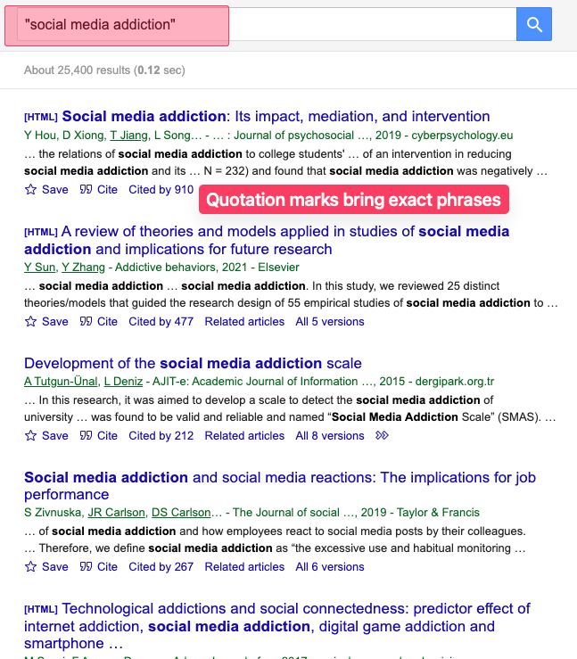
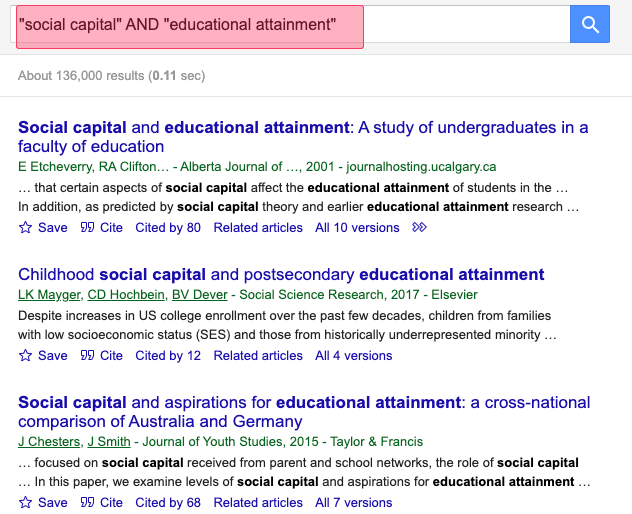
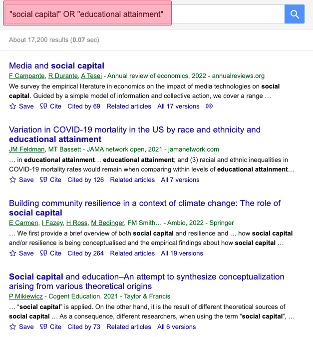

---
layout:
  title:
    visible: true
  description:
    visible: false
  tableOfContents:
    visible: true
  outline:
    visible: true
  pagination:
    visible: false
---

# Selective literature review

## Definition

A selective literature review gathers scholarly sources that directly relate to your specific research variables. It focuses only on the most relevant literature for your independent and dependent variables as you finish your paper. Unlike broader approaches (like citation chaining or using discovery engines), this method is more targeted and helps you find precisely what you need.

## Check your ResearchRabbit literature diagram

1. You may see relevant articles there.

## Prepare your search strategy

1. Identify the final version of your three independent variables and one dependent variable.
2. For each variable (three independent variables and one dependent variable), create a list of potential keywords, including synonyms and related terms.
   1. Example: For "social media use" (independent variable), try "social media," "online networking," or "digital communication." For "academic performance" (dependent variable), try "student achievement" or "grades."

## Conducting "searches" in google scholar

1. Go to [**Google Scholar**](https://www.scholar.google.com).
2. Start by searching each variable’s keywords one at a time to explore the literature.
3. Look at the titles, abstracts (summaries), and keywords of the top results to spot main ideas and trends.
4. Use <mark style="color:orange;">quotation marks</mark> for exact phrases: "social media addiction".

<figure><figcaption></figcaption></figure>

## Using Boolean Operators

1. Use Boolean operators to combine terms:
   1. When you use AND between two terms, your search results must contain BOTH terms. This narrows your results to the intersection of two concepts.
      1. AND: narrows results ("social capital" AND "educational attainment")&#x20;
         * This search will only return sources that discuss both social capital and educational attainment, focusing on their relationship.
         * Without AND, you might get sources that discuss either concept independently.

<figure><figcaption></figcaption></figure>

2. When you use OR between terms, your search results can contain EITHER term (or both). This broadens your results to include more sources.
   1. OR: broadens results ("social capital" OR "educational attainment")&#x20;
      * This search will return sources that discuss gentrification, urban renewal, or both topics.
        * This is useful when concepts have different names or when you want to explore related issues.

<figure><figcaption></figcaption></figure>

3. When you use NOT before a term, your search results will exclude sources containing that term. This helps filter out irrelevant material.
   1. NOT: excludes terms ("environmental racism" NOT "policy")
      * This search will return sources discussing environmental racism but exclude those focusing on policy.
        * This is helpful when you want to study non-policy aspects of forms of environmental racism.

<figure><figcaption></figcaption></figure>

## Finding definitions and conceptual work

1. To find papers that define concepts, use special search phrases:
   1. "**\[your variable]** is defined as"
   2. "**\[your variable]** refers to"
   3. "**\[your variable]** is conceptualized"
   4. "definition of **\[your variable]**"
   5. "conceptual framework of **\[your variable]**"

<figure><figcaption></figcaption></figure>

## Evaluating source relevance

1. Check the title and abstract first. If it doesn't seem relevant, stop reading.
2. Check citation count (higher counts often indicate influence).
   1. Be wary of sources with extremely low citation counts (unless very recent)

<figure><figcaption></figcaption></figure>

## Helpful tricks

1. **Use the "cited by" feature** to find newer papers that cite an important source.
2. Use Google Scholar's "Related articles" link that appears under each result.

<figure><figcaption></figcaption></figure>

3. Look at the reference lists of highly relevant papers (citation chaining).
4. Check the author profiles of key researchers in your field to find their other work.

<figure><figcaption></figcaption></figure>

## Integrating with previous methods

1. Connect your selective literature findings with sources discovered through citation chaining and ResearchRabbit. Add new articles to your ResearchRabbit literature diagram to see even more relevant articles.
