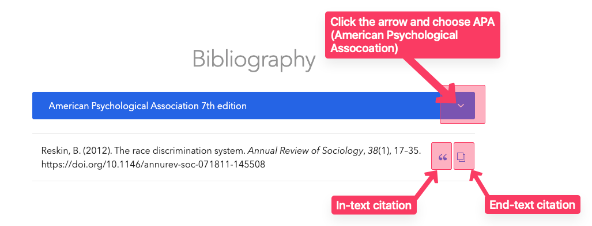

---
layout:
  title:
    visible: true
  description:
    visible: false
  tableOfContents:
    visible: true
  outline:
    visible: true
  pagination:
    visible: false
---

# Common mistakes and troubleshooting in RStudio

## <mark style="color:orange;">1. Not installing and loading packages</mark>

We need specific packages to conduct our analyses. Running the "install and run packages" is always the first step.

<figure><figcaption></figcaption></figure>

We can check the installed packages under “Packages.” checkmark means that the specific packages are loaded for the session.

<figure><figcaption></figcaption></figure>

## <mark style="color:orange;">2. Not loading the dataset</mark>

Every time we open RStudio, we must load the dataset.

Even if we see "gss" under “Environment,” we should run "load data" code again. If we do not see "gss" under "Environment," our codes will not work.

<figure><figcaption></figcaption></figure>

If the dataset is not loaded, we will get the following error (under the console):

<figure><figcaption></figcaption></figure>

## <mark style="color:orange;">3. Typing variable names</mark>

We **NEVER** type variable names! It is very common to miswrite codes, forget commas, etc. We always copy the variable names, and paste into our codes.

There is no variable called “maritaal”, but “marital.” RStudio warns us that “maritaal” is “unknown.” We copy and paste variable names to avoid this possibility.

<figure><figcaption></figcaption></figure>

## <mark style="color:orange;">4. Changing the original values of the dataset</mark>

We never save your data, but our R script files. From time to time, we may accidentally change the values of original variables (especially when we recode variables). When this happens, we go to the very top of the R script file and load the dataset again (see #2). If we created new variables previously, we will need to run those codes again since it will be a fresh data.

<figure><figcaption></figcaption></figure>

## 5. Not highlighting all the lines

We need to highlight all the lines and click “run.”

For single lines, we triple click (clicking three times _really_ fast).

For multiple lines, we highlighted the codes with mouse.

Here's what happens if we don't:

<figure><figcaption></figcaption></figure>

<figure><figcaption></figcaption></figure>

It simply shows what we highlighted and run, not a frequency table.

## 6. Not putting hashtags (#) for our comments

Typing notes on your RScript file is encouraged. When we type a note, we must put a hashtag (#) first. Not putting a hashtag (#) will confuse RStudio.

While line 72 will work, line 70 won’t. Here RStudio warns us that there is something wrong. Look at the cross on line 70.

<figure><figcaption></figcaption></figure>

## 8. Not using a model code

Whenever we run an analysis with a different variable, we simply copy the original code, paste under, change the variable name, and compare them. If our new codes do not work for some reason, we can easily compare them with the working codes. We call this “model” code.

Here the original variable was “sex”. We wanted to run the sample analysis for marital. If we don’t paste the working code for comparison, it’s likely that we may accidentally delete something extra. In this example, the comma was deleted.

<figure><figcaption></figcaption></figure>

Instead, we keep the “working” code and compare it with our new code. Here we see that the comma is missing in line 72.

<figure><figcaption></figcaption></figure>
