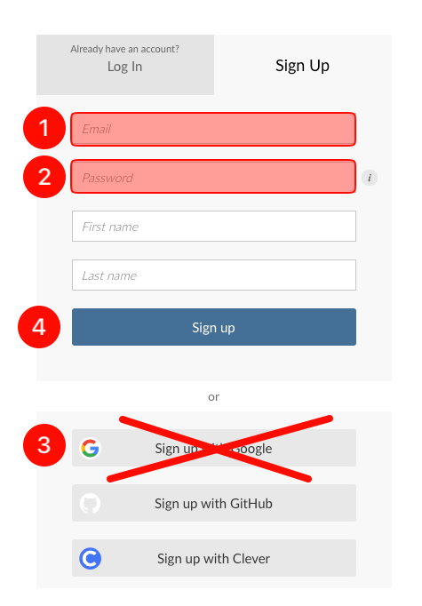

# Copy of How to create RStudio Cloud account and installing all the packages

## General instructions

1. This class will teach you how to use RStudio. You will be able to use this software on your browser.
2. You need to have a RStudio (Posit) Cloud account. The new name of RStudio Cloud is Posit. We will use the name of RStudio Cloud and Posit interchangeably.
3. Lab lectures are listed in the syllabus (Table 3: Course schedule), with topics beginning with “RStudio.”

## Assignment instructions



### RStudio website

1. Go to [https://posit.cloud/plans/free](https://posit.cloud/plans/free) and make sure you choose “free.”
2. Click "Sign up"

<figure><figcaption></figcaption></figure>



### School email address and a new password

1. Use your school email address.
2. Put a password (at least 10 characters). You will share your password with me, so note somewhere downn. As you see I will have access to your password. That's why you should not use this password somewhere else. You must:
   1. Use upper and lower case letters
   2. Use numbers
   3. Use special characters


I recommend [Bitward Free Password Generator](https://bitwarden.com/password-generator/#password-generator).


<figure><figcaption></figcaption></figure>

3. **DO NOT** use “Sign up with Google." Not now, not during the semester.
4. Click "Sign up."

<figure><figcaption></figcaption></figure>



<figure><figcaption></figcaption></figure>

Follow the procedures described in the [RStudio lab assignment: account and packages assignment instructions](https://docs.google.com/document/d/1P0gpXCsAk03u9fSdHNdMpO43TCbHUoJT/edit?usp=sharing\&ouid=100179871492576617561\&rtpof=true\&sd=true).

The process is also shown on the video below:



## <mark style="color:orange;">How to check how many hours left?</mark>

An RStudio Cloud free account allows you 25 hours of connect time per month. Every second the RStudio Cloud is open counts towards this allocated time.&#x20;

Therefore, whenever you are not running code or generating analyses, close the RStudio Cloud browser

Click on your name (see highlighted part #1). The highlighted part #2 shows the time period (e.g., "I will have 25 more hours on Aug 8, 2024"). The highlighted part #3 shows how many hours you have spent.

<figure><figcaption></figcaption></figure>

## <mark style="color:orange;">What to do if you exceed 25 hours per month?</mark>

25 hours of connect time is enough for this class. If you exceed this limit, open another free account using a different email address. Follow the procedures described in the [RStudio lab assignment: account and packages assignment instructions](https://docs.google.com/document/d/1P0gpXCsAk03u9fSdHNdMpO43TCbHUoJT/edit?usp=sharing\&ouid=100179871492576617561\&rtpof=true\&sd=true).

### <mark style="color:orange;">What to do if you want your new free account to be identical (files, packages, etc.) to the previous account where you exceeded the time limit?"</mark>


There is no need for this in this class.


1. Go to the previous account where you exceeded the time limit.
2. Click "Export" (see the highlighted part)

<figure><figcaption></figcaption></figure>

3. Click "Download"

<figure><figcaption></figcaption></figure>

4. It will download a zip file.
5. Go to your new account.
6. Upload that zip file just like you upload a R script file.
