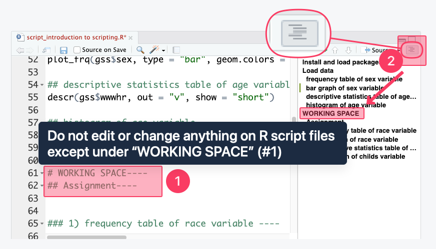
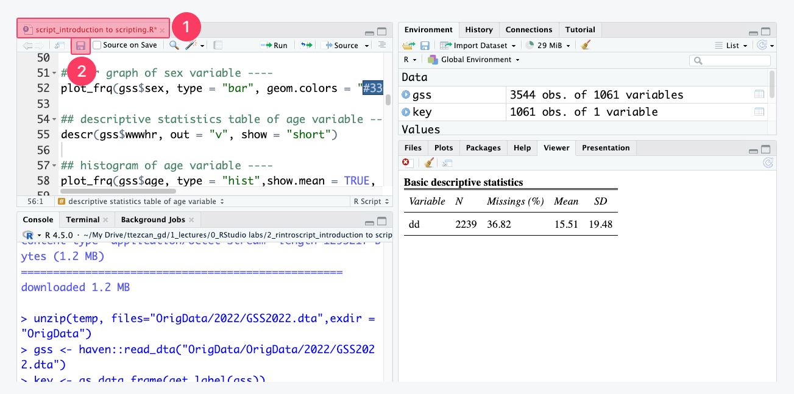
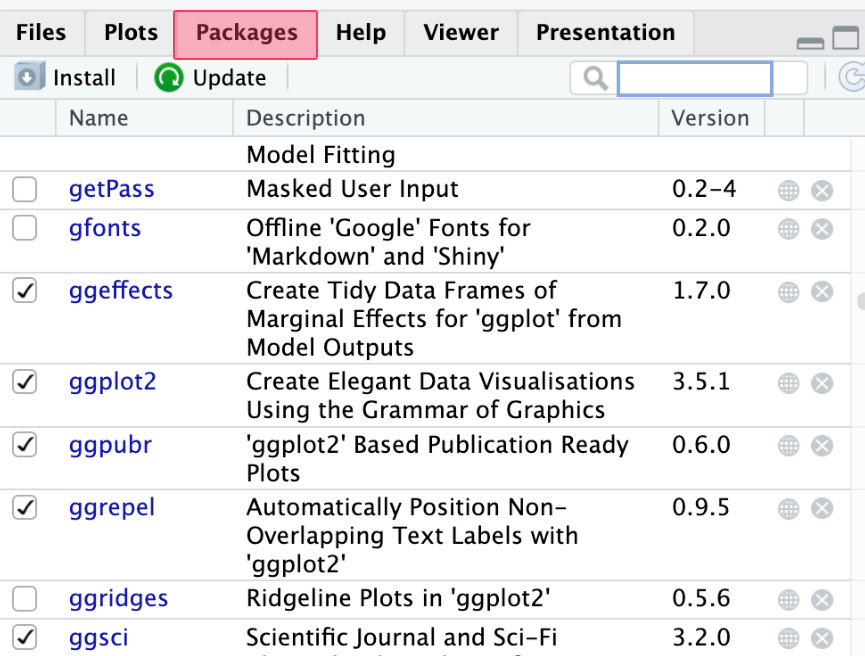
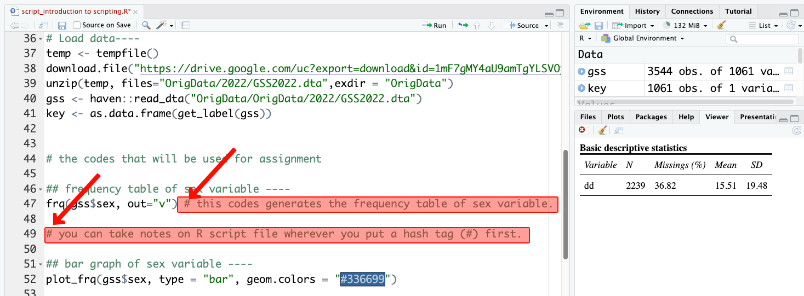
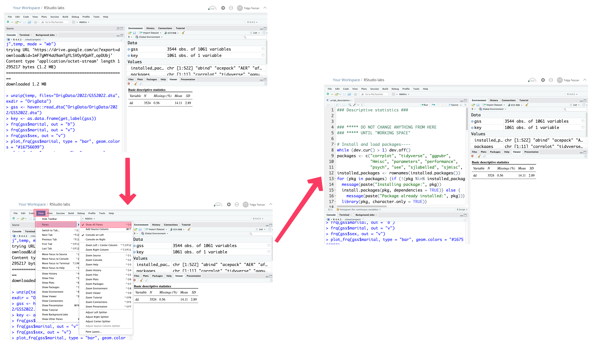

# Flashcards


Maximize your browser window to display the outline on the right side for easier navigation.


## A. Setup



### How to create RStudio Cloud account and installing all the packages

#### (A) Video guideline



#### (B) Textual guideline

Follow the procedures described in [\[How to create RStudio Cloud account and installing all the packages\]](https://ttezcan.gitbook.io/lectures/all-lectures-and-labs/r-lab/lab-resources/how-to-create-rstudio-cloud-account-and-installing-all-the-packages)



### How to open and use R script files in RStudio Cloud

#### (A) Video guideline



#### (B) Textual guideline

1. Open [RStudio Cloud website](https://posit.cloud/) and log in. Click "RStudio labs" under "Your content."
2. Download the R script file you need:
   1. Go to Canvas <mark style="color:red;">➜</mark> Resources module page <mark style="color:red;">➜</mark> “Lab resources” <mark style="color:red;">➜</mark> “All R script files” <mark style="color:red;">➜</mark> Click on the R Script file you need and download that file. [“All script files” is here](https://ttezcan.gitbook.io/lectures/all-lectures-and-labs/r-lab/lab-resources/all-r-script-files) for your convenience.
   2.  For example, if you need the "Descriptive Statistics" R script file. Click on it and download:

       <figure><figcaption></figcaption></figure>
3.  **Uploading R script files:** On [RStudio Cloud website](https://posit.cloud/), click “Upload” (see highlighted part #2 below). Click “Choose File.” Find the R script file you just downloaded (e.g., script\_descriptive.R) in the previous step, click “Open” and "OK."

    <figure><figcaption></figcaption></figure>
4.  **Opening R script files:** The file is uploaded and at the bottom of the "Files" list (see highlighted part #1). When you click on it, the descriptive R script file will open (see highlighted part #2).

    <figure><figcaption></figcaption></figure>
5.  **Installing and loading packages:** Make sure you click on the R script file name and open it (see highlighted part #1). Whenever we open RStudio, we highlight all the lines under the “Install and load packages” (see highlighted part #2) and click run (see highlighted part #3).

    <figure><figcaption></figcaption></figure>
6.  **Loading data:** When the process of installing and loading packages is completed, we highlight all the lines under the “Load data” (see highlighted part #1) and click “Run” (see highlighted part #2).  When you see “gss” and “key” (see highlighted part #3), it means we successfully installed and loaded the packages, and loaded the GSS data.

    <figure><figcaption></figcaption></figure>
7.  **Running the analysis codes:** We highlight the codes (see highlighted part #1) and click “Run” (see highlighted part #2). Clicking “Run” generates the analysis (see highlighted part #3).

    <figure><figcaption></figcaption></figure>
8.  **Using R script files - “working space” and outline view:** We do not edit or change anything on R script files except under “working space”(see highlighted part #1). Anything above the “working space” is teaching material! 

    The codes for assignments will be put under the “working space” 

    For easy navigation click “Outline” (see highlighted part #2) to see the headings and subheadings.

    <figure><figcaption></figcaption></figure>
9.  **Saving R script files:** When we make any changes, the font of the file name (shown in the highlighted part #2 above) will be red with an asterisk (\*) - (see the highlighted part #1 below). To save our progress, we click save (see the highlighted part #2 below)

    <figure><figcaption></figcaption></figure>



***

## B. How to work with RStudio



### Installing and loading packages

We need specific packages to conduct our analyses. Running the "install and run packages" is always the first step.

For troubleshooting, make sure to run "install and run packages" codes, wait until the “STOP” sign in the console disappears, no more code is running in the console, and see "Package already installed: _package name_" (under the console in red font, see the first figure).

<figure><figcaption></figcaption></figure>

We can check the installed packages under “Packages.” Checkmark means that the specific packages are loaded for the session. If there is no checkmark, we have the package but it was not loaded.

<figure><figcaption></figcaption></figure>



### Loading the data

Every time we open RStudio, we must load the data. Even if we see "gss" under “Environment,” we should run "load data" code again. If we do not see "gss" under "Environment," our codes will not work.

<figure><figcaption></figcaption></figure>

If the data is not loaded, we will get the following error (under the console):

<figure><figcaption></figcaption></figure>

For troubleshooting, make sure to run "install and run packages" codes and "load data" codes in order.



### Working in the "Working space"

We do not edit or change anything on R script files except under “working space”(see highlighted part #1). Anything above the “working space” is teaching material!

The codes for assignments will be put under the “working space”

For easy navigation click “Outline” (see highlighted part #2) to see the headings and subheadings.

<figure><figcaption></figcaption></figure>

If we accidentally delete something from the R script file (above the working space), we can undo the changes using ctrl + Z for Windows or command + Z for macOS. If we lose track of the changes or cannot undo them, we simply re-upload the original R script file.

If this happens, we should first rename the current R script file because re-uploading the file will overwrite it and we lose our previous progress. Based on the sample below, we can rename the file to 'script\_scripting\_previous.R' (make sure not to delete the ".R" file extension at the end). Click "check box" (see highlighted part #1) and click "Rename" (see highlighted part #2)&#x20;

<figure><figcaption></figcaption></figure>



### Working on codes in RStudio, not in assignment files

The lab assignments will ask you to paste the code for specific questions. Write and test the code in RStudio, and once it works, paste it into the assignment file. Do not write codes directly in the assignment file.

<figure><figcaption></figcaption></figure>



### Using a model code

Whenever we run an analysis with a different variable, we create a model code and a working code.

<figure><figcaption></figcaption></figure>

<figure><figcaption></figcaption></figure>

This is a view from the [Code templates](https://ttezcan.gitbook.io/lect/all-lectures-and-labs/r-lab/lab-resources/code-templates) page. Triple click the code and copy, or click "Copy" (see the highlighted part).

<figure><figcaption></figcaption></figure>

If we don’t use model code for comparison, it is likely that we accidentally delete something extra. In this example, the comma was deleted.

<figure><figcaption></figcaption></figure>

Instead, we keep the use model code and compare it with our working code. Here we clearly see that the comma is missing in line 79. Note that RStudio warns us that something is wrong with that red cross.

<figure><figcaption></figcaption></figure>

After identifying what is missing, we can fix the working code. Once the working code functions correctly, we can delete the model code.

<figure><figcaption></figcaption></figure>



### Pasting variable names

We **NEVER** type variable names! It is very common to miswrite codes, forget commas, etc. We always copy the variable names (from the code templates page or assignments), and paste into our codes.

There is no variable called “maritaal”, but “marital.” RStudio warns us that “maritaal” is “unknown.” We copy and paste variable names to avoid this possibility.

<figure><figcaption></figcaption></figure>



### Highlighting all the lines when running codes

We need to highlight all the lines and click “Run.”

* For single lines, we triple click (clicking three times _really_ fast).
* For multiple lines, we highlight the codes with mouse.

Here's what happens if we don't:

<figure><figcaption></figcaption></figure>

It simply shows what we highlighted and run (check the console part), not the analysis (check the plots part).

Instead, we should have highlighted all the line:

<figure><figcaption></figcaption></figure>



### Putting hashtags (#) for our notes (how to work)

Typing notes on our R script files is encouraged. When we type a note, we must put a hashtag (#) first (we can put # anywhere we want). Likewise I use "notes" in R script files to communicate with you.

<figure><figcaption></figcaption></figure>

Not putting a hashtag (#) will confuse RStudio.

While line 29 will work, line 27 won’t. Here RStudio warns us that there is something wrong. Look at the red cross on line 27. When there is a red cross on the left side of the line number, there is something wrong with our codes.

<figure><figcaption></figcaption></figure>



### Not changing the original values of the dataset

We **never** save our data, but our R script files. From time to time, we may accidentally change the values of original variables (especially when we recode variables).&#x20;

When this happens, we go to the very top of the R script file and load the data again. If we created new variables previously, we will need to run those codes under our working space again in order since it will be a fresh data.

<figure><figcaption></figcaption></figure>



***

## C. Keyboard and mouse shortcuts



### Using keyboard shortcuts

<figure><figcaption></figcaption></figure>



### Keyboard shortcuts: hand and finger positions (how to work)

<figure><figcaption></figcaption></figure>



### Using mouse shortcuts

<figure><figcaption></figcaption></figure>



***

## D. Common recoding issues



### Different recoding codes for different variables

Recoding a categorical variable and a continuous variable requires slightly different codes

<figure><figcaption></figcaption></figure>


**Troubleshooting:**

* You need to check the "variable type" column of the variable (in "Variables in GSS page") you recode.
  1. If you recode a categorical variable, use comma (,) between the values for merging.
  2. If you recode a continuous variable, use colon (:) between the values.




### Use the recoded (new) variable in analyses

When we want to display, for example, the frequency distribution of a recoded (new) variable, we must use the recoded (new) variable’s name in the frequency code.

This is because, for our analysis, the original variable is no longer relevant. We recoded the original variable and created a new one for our analysis needs.


Wrong:&#x20;

frq(gss$<mark style="color:yellow;">**marital**</mark>, out = "v")



Correct:

frq(gss$<mark style="color:yellow;">**maritalgroups**</mark>, out = "v")



**Troubleshooting:**

* After the recoding process, use the recoded (new) variable in analyses. Make sure you do not use the original variable name in analyses.




### Recoded variables are always categorical

When we recode a continuous variable, the new (recoded) variable is no longer continuous.

It becomes <mark style="color:red;">CATEGORICAL</mark> because we have merged the real numbers, and they no longer remain as real numbers.

Therefore, for example, we use the <mark style="color:red;">FRQ</mark> code to see the frequency distribution.


Wrong:&#x20;

descr(gss$<mark style="color:yellow;">**educgroups**</mark>, out = "v", show = "short")



Correct:

frq(gss$<mark style="color:yellow;">**educgroups**</mark>, out = "v")



**Troubleshooting:**

* Recoded variables are always categorical. Therefore, they should be treated categorical in every analyses they are used.




### Not using a model code

<figure><figcaption></figcaption></figure>

Use the [Code templates](https://ttezcan.gitbook.io/lect/all-lectures-and-labs/r-lab/lab-resources/code-templates) page and Model codes:

<figure><figcaption></figcaption></figure>

<figure><figcaption></figcaption></figure>


**Troubleshooting:**

* In code templates page, there are [recoding templates for both categorical and continuous variables](https://ttezcan.gitbook.io/lectures/all-lectures-and-labs/r-lab/lab-resources/code-templates#recoding), with every kind of value possibility.
  1. determine what kind of recoding you need (merging, reversing, or transforming continuous variables into groups)
  2. determine how many values you will need in your recoded (new variables).




### Pasting the original variable to the correct place

<figure><figcaption></figcaption></figure>


**Troubleshooting:**

1. The original variable you need to recode should be pasted (not typed) into the red area
2. The new variable variable name that RStudio will create when you run the code should be pasted (not typed) into the yellow area.




### Load GSS data again if variables are misplaced in the codes and have thus overwritten the original values

If variables are misplaced in the codes and have overwritten the original values, we have to “Load GSS” again, because we lost the values of the original variable and we need a fresh data.

We **never** save our data, but our R script files. From time to time, we may accidentally change the values of original variables (especially when we recode variables).&#x20;

When this happens, we go to the very top of the R script file and load the data again. If we created new variables previously, we will need to run those codes under our working space again in order since it will be a fresh data.

<figure><figcaption></figcaption></figure>


**Troubleshooting:**

1. Mistakes happen. For example, you could put the new variable name into the wrong part of the code. When this happens, the values of the original variable are lost.
2. Therefore, you should run the "Load data" codes again.
3. Make sure you run each code again before the wrong code, because they are also lost.




***

## E. Common computing issues



### Use the new (recoded) variables in computation code


Wrong:

gss <- gss %>%

&#x20; rowwise() %>%

&#x20; mutate (<mark style="color:red;">hapindex</mark> = mean (c(<mark style="color:red;">happy</mark>,<mark style="color:red;">life</mark>,<mark style="color:red;">satfin</mark>)))



Correct:

gss <- gss %>%

&#x20; rowwise() %>%

&#x20; mutate (<mark style="color:red;">hapindex</mark> = mean (c(<mark style="color:red;">happynew</mark>,<mark style="color:red;">lifenew</mark>,<mark style="color:red;">satfinnew</mark>)))



**Troubleshooting:**

* When creating a computed variable and if the original variables need to be recoded, then make sure you use the new variable names in the computation code. For such analyses, the original variables were not useful. That's why they were recoded.




### Computed variables are always continuous

When we compute variables and create an index, the new (computed) variable is continuous.

It becomes CONTINUOUS because we have created a score, and we treat it as a real number.

Therefore, we use the DESCR code to see the distribution (mean and standard deviation)


Wrong:

frq(gss$<mark style="color:red;">hapindex</mark>, out = "v", show = "short")



Correct:

descr(gss$<mark style="color:red;">hapindex</mark>, out = "v")



**Troubleshooting:**

* Computed variables are always continuous. Therefore, they should be treated continuous in further analyses.




### Use a model code

Use the Code templates page.

<figure><figcaption></figcaption></figure>


**Troubleshooting:**

* In code templates page, there are [computing templates](https://ttezcan.gitbook.io/lectures/all-lectures-and-labs/r-lab/lab-resources/code-templates#computing) for every kind of value possibility.
* Do not start computing process without using code templates page.




***

## F. Miscellaneous



### Is my p-value less than 0.05?

#### Statistical significance

Statistical significance is a measure of whether your research findings are meaningful. In other words, if the independent variable causes a change in the dependent variable in a statistically significant way.

The lower the p-value, the greater the statistical significance of the observed difference.

We refer to statistical significance as <mark style="color:red;">p < 0.05</mark>

#### Use the following website:

[https://www.whichnumberislarger.com/](https://www.whichnumberislarger.com/)



### Data terminologies

<mark style="color:red;">Questionnaire:</mark> A set of written questions used for collecting information from respondents.

<mark style="color:red;">Respondents:</mark> Individuals who respond to the questions in a questionnaire.

<mark style="color:red;">Dataset:</mark> The information collected from respondents. The numbers to be analyzed.

<mark style="color:red;">Full wording of question:</mark> The exact text of a question as it appears in the questionnaire.

<mark style="color:red;">Variable name:</mark> Unique words assigned to each question. We use variable names in data analysis software.

<mark style="color:red;">Values:</mark> Numbers such as 1, 2, 3, etc., that appear in the dataset representing specific responses.

<mark style="color:red;">Labels:</mark> What those values (numbers) mean, e.g., 1: yes, 2: no, etc.

<mark style="color:red;">Response set:</mark> The combination of values and their corresponding labels.

<figure><figcaption></figcaption></figure>

<figure><figcaption></figcaption></figure>

<figure><figcaption></figcaption></figure>

[\[Variables in GSS\]](https://ttezcan.gitbook.io/lectures/all-lectures-and-labs/r-lab/lab-resources/variables-in-gss)

<figure><figcaption></figcaption></figure>



### GSS codebooks

* [GSS 2022 Codebook website](https://gssdataexplorer.norc.org/variables/vfilter)
* [GSS 2022 Codebook pdf file](https://drive.google.com/open?id=1_-FMP3vDlPOiD1_KKkZjEIy3KNnnYOSP\&usp=drive_fs)



***

## G. RStudio issues and usage&#x20;



### Opening all the panes

Sometimes you may accidentally close one of the panes. When that happens, click "View" <mark style="color:red;">➜</mark>  "Panes" <mark style="color:red;">➜</mark> "Show All Panes."

<figure><figcaption></figcaption></figure>



### What to do if RStudio Cloud crashes?

This may happen if your RStudio Cloud session consumes too much ram.

1.  Save your unsaved RScript file.

    **Saving R script files:** When we make any changes, the font of the file name (shown in the highlighted part #2 above) will be red with an asterisk (\*) - (see the highlighted part #1 below). To save our progress, we click save (see the highlighted part #2 below)

<figure><figcaption></figcaption></figure>

2.  Click the three dots next to the gear. Click "Relaunch Project."

    <figure><figcaption></figcaption></figure>
3. When you work on a R script file right after relaunching project, you need to run "install and load packages" and "load data" (as always).



### How to check how many hours left in RStudio Cloud?

An RStudio Cloud free account allows you 25 hours of connect time per month. Every second the RStudio Cloud is open counts towards this allocated time.&#x20;

Therefore, whenever you are not running code or generating analyses, close the RStudio Cloud browser

Click on your name (see highlighted part #1). The highlighted part #2 shows the time period (e.g., "I will have 25 more hours on Aug 8, 2024"). The highlighted part #3 shows how many hours you have spent.

<figure><figcaption></figcaption></figure>



### What to do if you exceed 25 hours per month?

25 hours of connect time is enough for this class. If you exceed this limit, open another free account using a different email address. Follow the procedures described in the [How to create RStudio Cloud account and installing all the packages](https://ttezcan.gitbook.io/lectures/all-lectures-and-labs/r-lab/lab-resources/how-to-create-rstudio-cloud-account-and-installing-all-the-packages).

#### What to do if you want your new free account to be identical (files, packages, etc.) to the previous account where you exceeded the time limit?

1. Go to the previous account where you exceeded the time limit.
2. Click "Export" (see the highlighted part)

<figure><figcaption></figcaption></figure>

3. Click "Download"

<figure><figcaption></figcaption></figure>

4. It will download a zip file.
5. Go to your new account.
6. Upload that zip file just like you upload a R script file.



### Using RStudio on a university lab computer

Every time you log in to a lab computer, you have to run "install and load packages" codes.

Because when you log out, lab computers revert to their factory settings and deletes the installed packages.

1. First, download the R Script file that you want to use.  [All R Script files here](https://ttezcan.gitbook.io/lectures/all-lectures-and-labs/r-lab/lab-resources/all-r-script-files).
2. Type "RStudio" on the search bar of the computer. Open RStudio.
3. On RStudio, Click File <mark style="color:red;">➜</mark> Open File.
4. Find the Script file that you just downloaded, and click Open.
5. **DO NOT DOUBLE CLICK R SCRIPT FILES.** It may open R, instead of RStudio.

<figure><figcaption></figcaption></figure>



### Downloading R and RStudio to a personal computer

You can download R and RStudio to your personal computer.  "Install and load packages" codes will install the packages once, but every time you open RStudio on your personal computer, you should run "Install and load packages" again.

#### Mac users

[Check your macOS version](https://support.apple.com/en-us/HT201260)

#### Mac Users (macOS 12+) and Apple silicon (M1-3) Macs:

1\. [Download R ](https://cran.r-project.org/bin/macosx/big-sur-arm64/base/R-4.4.1-arm64.pkg)(4.4.1)

2\. [Download RStudio ](https://download1.rstudio.org/electron/macos/RStudio-2024.04.2-764.dmg)(2024.04.2+764)

#### Mac Users (macOS 12+) and older Intel Macs:

1\. [Download R ](https://cran.r-project.org/bin/macosx/big-sur-x86_64/base/R-4.4.1-x86_64.pkg)(4.4.1)

2\. [Download RStudio ](https://download1.rstudio.org/electron/macos/RStudio-2024.04.2-764.dmg)(2024.04.2+764)

#### Mac Users (macOS El Capitan and older)

[1. Download R](https://cran-archive.r-project.org/bin/macosx/el-capitan/base/R-3.6.3.pkg) (3.6.3)

[2. Download RStudio](https://download1.rstudio.org/desktop/macos/RStudio-1.4.1717.dmg) (1.4.1717)

macOS may want you to allow it to download. Open System Preferences, navigate to Security & Privacy, and then General. See the photo below and hit allow (you may need to click the lock at the bottom to unlock)

#### Video guidance (macOS)



#### Windows Users

1\. [Download R](https://cran.r-project.org/bin/windows/base/R-4.4.1-win.exe) (4.4.1)

2\. [Download RStudio](https://download1.rstudio.org/electron/windows/RStudio-2024.04.2-764.exe) (2024.04.2-764)

Windows users may need to change some of their settings.

Select Start <mark style="color:red;">➜</mark> Settings <mark style="color:red;">➜</mark> Apps <mark style="color:red;">➜</mark> Apps & features. Under Installing apps, select "Allow apps from anywhere."

#### Video guidance (Windows)




