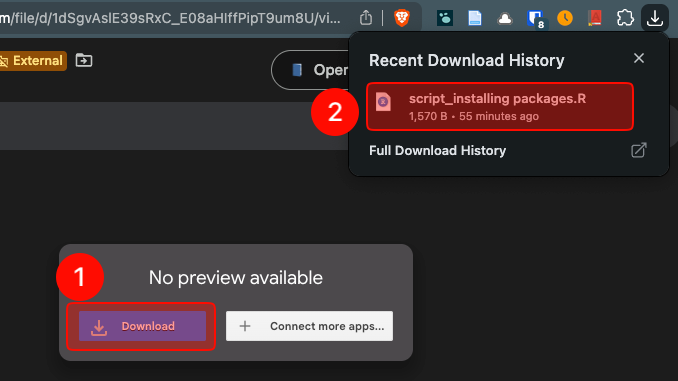
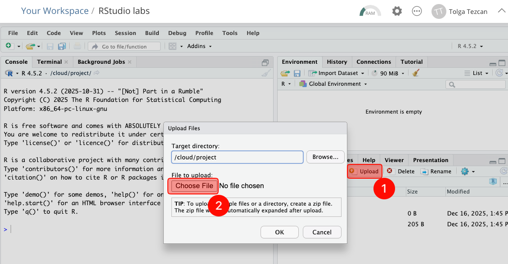
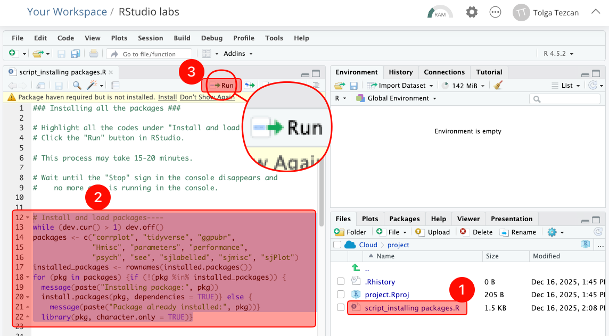
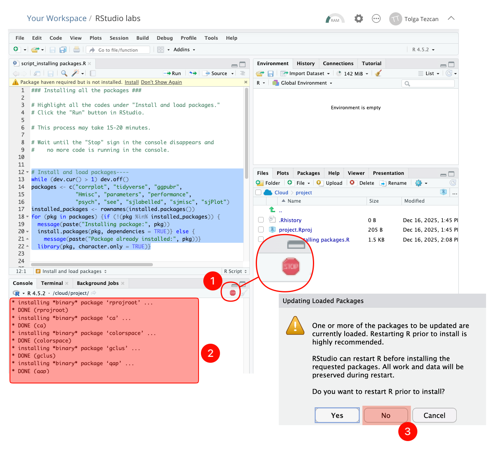
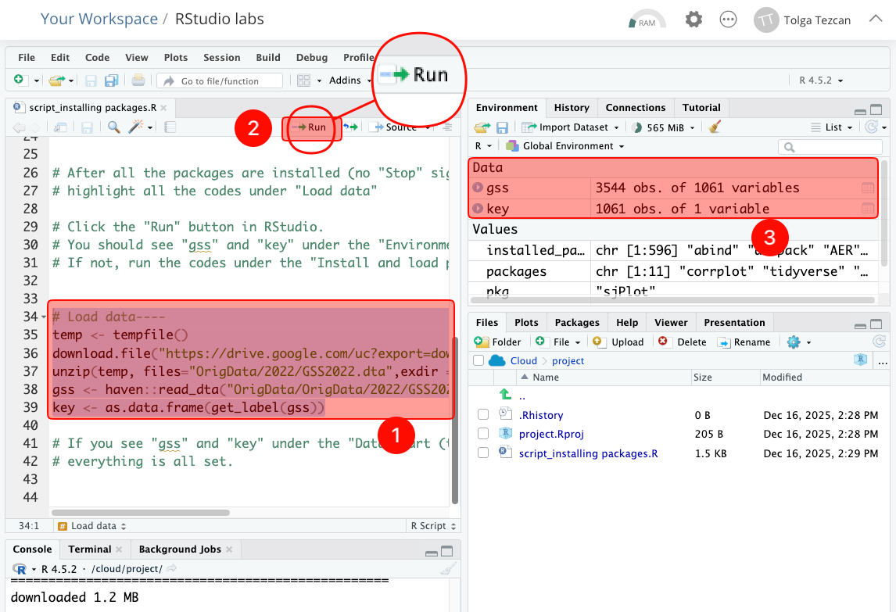

# How to create RStudio Cloud account and installing all the packages


Students **cannot** continue this class without getting full credit from this assignment (unlimited attempts).



This class will teach you how to use RStudio. You will be able to use this software on your browser.

You need to have a RStudio (Posit) Cloud account. The new name of RStudio Cloud is Posit. We will use the name of RStudio Cloud and Posit interchangeably.



Lab lectures are listed in the syllabus (Table 3: Course schedule), with topics beginning with “RStudio.”


## Assignment video 

The video below shows how to complete this assignment from start to finish.

> **Do not** submit this assignment <mark style="color:red;">without</mark> watching the video and read the instructions together.



## Assignment instructions



### RStudio website

1. Go to [https://posit.cloud/plans/free](https://posit.cloud/plans/free) and make sure you choose “free.”
2. Click "Sign up."

<figure><figcaption></figcaption></figure>



### School email address and a new password

1. Use your school email address.
2. Put a password (at least 10 characters). You will share your password with me, so note it somewhere down. As you see I will have access to your password. That's why you should not use this password somewhere else. You must:
   1. Use upper and lower case letters
   2. Use numbers
   3. Use special characters


I recommend [Bitward Free Password Generator](https://bitwarden.com/password-generator/#password-generator).


<figure><figcaption></figcaption></figure>

3. **DO NOT** use “Sign up with Google." Not now, not during the semester.
4. Click "Sign up."

<figure><figcaption></figcaption></figure>



### Verification

1. Go to your school email inbox and click “Verify.”
2. You will be directed to [https://posit.cloud](https://posit.cloud/plans/free). If not, click on the link.



### New project (RStudio labs)

1. Click "New Project."
2. Choose "New RStudio Project."&#x20;
   1. You will wait 10-15 second while RStudio deploys the project. If it takes longer, refresh your page.
3. On the new screen, click on “Untitled Project” and type “RStudio labs”.

<figure><figcaption></figcaption></figure>


Note: In previous semesters, many students mistakenly created a separate project for each lab. **This is incorrect.** You will not create a new project for each lab. Instead, you will always work within the existing 'RStudio labs' project throughout the course.


<figure><figcaption></figcaption></figure>



### Download the specific R script file for this assignment

1. [**Click here and download script\_installing packages.R**](https://drive.google.com/open?id=1dSgvAslE39sRxC_E08aHIffPipT9um8U\&usp=drive_fs)
2. **Do not** click on this file.

<figure><figcaption></figcaption></figure>



### Upload that R script file to RStudio

1. Click "Upload" on RStudio.
2. Click "Choose file." Find the R script file you just downloaded (script\_installing packages.R) in the previous step and click “Open.”

<figure><figcaption></figcaption></figure>



### Install and load packages

1. After completing the previous step, you will see "script\_installing packages.R" under "Files."
   1. Click on "script\_installing packages.R."
2. As soon as you click on "script\_installing packages.R," you will see the content of this file on the left side.
   1. Highlight all the lines under the “Install and load packages.”
3. Click "Run."

<figure><figcaption></figcaption></figure>



### Wait

This process will install all the packages we’ll be using throughout the semester. This process may take <mark style="color:red;">**15-20 minutes**</mark> or shorter depending on your internet connection. This is a one-time process.&#x20;

You won't wait this long again during the semester.

1. You will see a <mark style="color:red;">STOP</mark> sign.
2. And, codes are running in the console. You should wait until the <mark style="color:red;">STOP</mark> sign in the console disappears and no more code is running in the console.
3. During this process, if you see the pop-up window above (Updating Loaded Packages), click “No” every single time.

<figure><figcaption></figcaption></figure>



### Load data

1. When the process above is completed, scroll down on the script file. Highlight all the lines under the “Load data.”
2. And, click "Run."
3. When the process above is completed, you should see “gss” and “key” under the “Environment” part.
4. Take a screenshot of this view as you will submit this view to Canvas.
   1. [\[Instructions: How to take a screenshot\]](https://ttezcan.gitbook.io/lectures/all-lectures-and-labs/guidelines-and-rubrics/how-to-take-a-screenshot)

<figure><figcaption></figcaption></figure>



### Submission to Canvas

Click on "\[gr] RStudio lab assignment: Account and packages" under the "getting ready for the class" Module on Canvas.

There are two questions:

1. Paste your email address and the new password
2. Upload the screenshot showing your RStudio view with "gss" and "key." Your screenshot should look like the image above.

<figure><figcaption></figcaption></figure>


