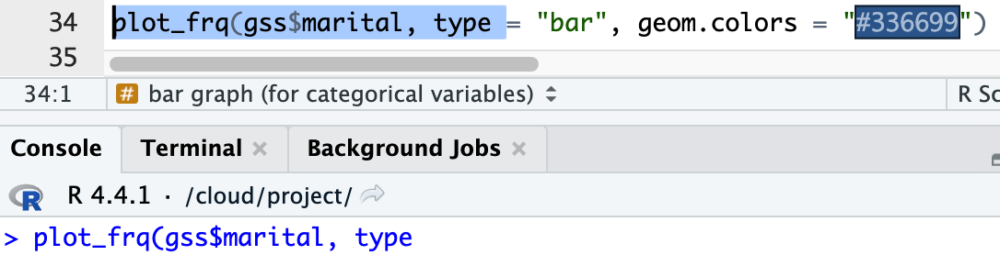

---
layout:
  title:
    visible: true
  description:
    visible: false
  tableOfContents:
    visible: true
  outline:
    visible: true
  pagination:
    visible: false
---

# Welcome to SBS321-02

<figure><figcaption></figcaption></figure>

## <mark style="color:orange;">Welcome!</mark>

Welcome to SBS321 - Survey Research!

My name is Tolga Tezcan, associate professor of sociology, and I'm your instructor. [You can check me CV here](https://docs.google.com/document/d/16HdRvPXse\_88mQysbXL6SdoQP2MEhRmX/edit?usp=sharing\&ouid=100179871492576617561\&rtpof=true\&sd=true).

This page will make you familiar with the course, structure, what to expect, and some other important information.

## <mark style="color:orange;">Syllabus</mark>

[The syllabus is here](https://docs.google.com/document/d/1ikXXuRIGiZm4yhFsMpq4GFSTLqqVkrsu/edit?usp=sharing\&ouid=100179871492576617561\&rtpof=true\&sd=true), also under the "Resources" page of Canvas (The first module).

Read the syllabus before the first class and bring me your questions.

## <mark style="color:orange;">First meeting</mark>

Our first meeting is held on <mark style="color:red;">08/26</mark> - <mark style="color:red;">Monday at 10 am</mark> at [Heron Hall](https://goo.gl/maps/YgdtjK5542qNHV8Z9) - Room 104.

Please arrive the classroom at least 5 minutes early.

I will explain the class structure, go over the syllabus in detail, and answer your questions.

There will be a **graded attendance quiz**. Make sure to bring an electronic device to take the attendance quiz on Canvas. Ensure you have access to Canvas.&#x20;

If you cannot attend the first class, you have an opportunity to write 700 words lecture reflection to compensate for the missed points.

## <mark style="color:orange;">Assignments for the first class</mark>

There are a couple of assignments associated with the first class.&#x20;

Feel free to submit these assignments during the summer if you wish. I will grade the assignments in 48 hours during the summer.

You can find these assignments under the module named (Week 1).

Assignments with a \[fw] code (except for the syllabus quiz) can be resubmitted unlimited times within the deadline period.&#x20;

* **\[fw] Google Drive assignment (the assignment that must be submitted first)** <mark style="color:red;">(due by 08/27 - 11:59 pm)</mark>
  * There is a video instruction for this assignment.
  * This assignment needs to be submitted first. When graded, you will receive a notification email with feedback. Follow the feedback and resubmit it until you receive full credit within the deadline. Without getting full credit from the “Google Drive Assignment” (comes with unlimited attempts within the deadline), students cannot continue the course. Do not submit the rest of the assignments before getting full credit from this assignment.
* **\[fw] Canvas notification settings assignment** <mark style="color:red;">(due by 08/28 - 11:54 pm)</mark>
* **\[fw] Google Calendar assignment** <mark style="color:red;">(due by 08/28 - 11:55 pm)</mark>
  * There is a video instruction for this assignment.
* **\[fw] RStudio lab assignment: account and packages** <mark style="color:red;">(due by 08/28 - 11:56 pm)</mark>
  * There is a video instruction for this assignment.
* **\[fw] Syllabus quiz** <mark style="color:red;">(due by 08/28 - 11:57 pm)</mark>
  * No resubmission option. No time limit.
* **\[fw] Introduce yourself** <mark style="color:red;">(due by 08/28 - 11:58 pm)</mark>
* **\[fw] lecture reflection (first class)** <mark style="color:red;">(due by 08/28 - 11:59 pm)</mark>
  * You do not submit this if you attend the first class. You do not need to submit the rest of the lecture reflections through out the semester if you attend the classes.

## <mark style="color:orange;">Deadlines</mark>

<figure><figcaption></figcaption></figure>

1. After the deadline has passed, Canvas will automatically give a zero, but students are granted <mark style="color:red;">one (1) additional (flexibility) day</mark> to submit their work without a deduction.
2. Once the assignment deadline and the flexibility day has passed, students are granted an additional two-day window to submit their work.  <mark style="color:red;">A 20% deduction</mark> will be applied for the first day of delay, and <mark style="color:red;">a 30% deduction</mark> in total for the second day of delay.

## <mark style="color:orange;">Class structure</mark> 

We have two lectures each week. The first class is lab, the second class is regular lecture.&#x20;

Below is a sample overview, which includes two lectures:

1. RStudio: Descriptive statistics (lab lecture)
2. Introduction to survey methodology (regular lecture)

Each lecture is accompanied by three assignments (indented items are assignments associated with the specific lecture above):

<figure><figcaption></figcaption></figure>

Click on the lecture names to see the readings, slides, and lecture videos. See [\[Where are the readings, slides, and lecture videos?\]](https://ttezcan.gitbook.io/lectures/all-lectures-and-labs/guidelines-and-rubrics/where-are-the-readings-slides-and-lecture-videos)

## <mark style="color:orange;">General format of the lectures</mark>

The general format of the lectures is as follows, though note that adjustments may be made for certain specific lectures:

<figure><figcaption></figcaption></figure>

Note: Lab lectures are listed in Table 3 (Course schedule) in the syllabus, with topics beginning with “RStudio.” Students should arrive in the classroom <mark style="color:red;">at least 5 minutes early on lab days</mark> to:

* log in to the lab computer,&#x20;
* log in to RStudio Cloud (Posit), and
* log in to Canvas.&#x20;
* download the script file, and&#x20;
* run the packages and data codes.

## <mark style="color:orange;">Assignments</mark>

1. **Quizzes**: Taken in the classroom and cannot be taken outside the classroom.
2. **Lecture assignments**: We'll start (and most of the time finish) these assignments during the class.
3. **Lecture reflection**: No need to submit a lecture reflection if you attend the class.&#x20;
   1. Missed in-class quizzes can be compensated with a [lecture reflection](https://ttezcan.gitbook.io/lectures/all-lectures-and-labs/guidelines-and-rubrics/lecture-reflections#video-reflection-guidelines). Those who wish to improve specific in-class quiz grades can also submit lecture reflections.

## <mark style="color:orange;">Exams</mark>

1. Midterm (<mark style="color:red;">10/23 - 10am</mark> @ classroom, in-person)
2. Final exam (<mark style="color:red;">12/18 - 10am</mark> @ classroom, in-person)

## <mark style="color:orange;">Assignment submissions</mark>

1. Assignments should not be attached. For this lecture, students will not download or upload any documents.
2. Assignments should be submitted to Canvas using Google LTI: [\[How to submit an assignment\]](https://ttezcan.gitbook.io/lectures/all-lectures-and-labs/guidelines-and-rubrics/how-to-submit-an-assignment).
3. As explained in [\[How to submit an assignment\]](https://ttezcan.gitbook.io/lectures/all-lectures-and-labs/guidelines-and-rubrics/how-to-submit-an-assignment),
   1. The copied version of the Google Doc assignments must be in the correct weekly subfolders. If they are not, move them: [\[How to move a file in Google Drive\]](https://ttezcan.gitbook.io/lectures/all-lectures-and-labs/guidelines-and-rubrics/how-to-move-a-file-in-google-drive)
   2. If the name of the weekly subfolders or Google Doc assignments are incorrect. rename them: [\[How to rename a file and folder in Google Drive\]](https://ttezcan.gitbook.io/lectures/all-lectures-and-labs/guidelines-and-rubrics/how-to-rename-a-file-and-folder-in-google-drive)
4. When the lecture assignment has a [\[Highlighting and Commenting\] ](https://ttezcan.gitbook.io/lectures/all-lectures-and-labs/guidelines-and-rubrics/highlighting-and-commenting-assignment-instructions)link at the very top, students must annotate the instructions following the [\[Highlighting and Commenting\] ](https://ttezcan.gitbook.io/lectures/all-lectures-and-labs/guidelines-and-rubrics/highlighting-and-commenting-assignment-instructions)guideline before starting the assignment; otherwise, they will receive a <mark style="color:red;">-10 penalty</mark>.
5. When there is “WC” (Word count) under the responses, students must provide the word count of their responses; otherwise, they will receive a <mark style="color:red;">-5 penalty.</mark> Incorrect word counts also receive a <mark style="color:red;">-5 penalty</mark>.

## <mark style="color:orange;">What are the benefits of attending classes?</mark>

* **Less work:** No need to write a 700-word lecture reflection to compensate for each missed in-class quiz.
* **Better comprehension:** During the 30-40 minute lecture, you will take notes for in-class quizzes, helping you better understand the content (see “Maximizing learning within limited time” under the “Teaching and Learning Structure” in the syllabus).
* **Immediate feedback:** After the in-class quiz and a 5-minute break, you will begin the assignment, and I will provide individual feedback right away and answer any questions.
* **One-on-one meetings:** I always arrive 15 minutes early to the class and stay 15 minutes late. Schedule an appointment and ask me your questions before or after class, or during the break.
* **Making friends and networking:** Over half of the assignments are done in groups (2-3 members, with different peers each class). This helps you make friends and look forward to seeing each other.
* **College Experience:** Regular attendance provides a real college life experience. College is more than just grades; it is about networking and developing social skills.

## <mark style="color:orange;">How to work for this class?</mark>

1. Attend the classes.
2. Do the reading before coming to class.&#x20;
3. Review the slides before coming to class.&#x20;
4. Take notes during the class (paper-pen-method).
5. Watch the lab lecture videos <mark style="color:red;">after class</mark> if you were late or struggled.&#x20;
6. Watch the lab lectures videos <mark style="color:red;">before coming to a lab class</mark> if you struggled during the previous lab lectures.

## <mark style="color:orange;">Incorrect submissions</mark>

Students should review their document <mark style="color:red;">before</mark> and <mark style="color:red;">immediately after</mark> submission.

* Assignments submitted to Canvas will be graded, and grades are final.&#x20;
* There is no resubmission option.&#x20;
* Assignments should be submitted to Canvas. Assignments via email, message, or Canvas comment are not accepted.&#x20;
* If there is no document in the weekly subfolder, no credit will be given even if a submission is made that would normally receive full credit.

Some exceptions:

1. **Wrong document submission**:&#x20;
   1. If students submit a wrong document and <mark style="color:red;">comment "submitted a wrong document</mark>" on the Canvas assignment section before grading, the correct document from their Google Drive week folder will be graded without deduction. Assignments revised or created after the due date do not qualify for this option.
   2. If no comment is made and the correct document is already in the Google Drive week folder at the time of grading, it will be graded with a <mark style="color:red;">10% deduction</mark>, using Google Doc Version History. Assignments revised or created after the due date do not qualify for this option.
2. **Submission made but no document in the Google Drive weekly subfolder:**&#x20;
   1. If submission is made and there is no document in the weekly subfolder, zero will be given and I will contact the student. Upon notification, the student may move the file to the relevant week's subfolder and <mark style="color:red;">type "moved"</mark> in the Canvas comment section of the assignment. The assignment will then be graded with a <mark style="color:red;">10% deduction</mark>. Assignments revised or created after this communication do not qualify for this option.

## <mark style="color:orange;">Late enrollment</mark>

If you are enrolled late in this class, read the syllabus and the welcoming page that was sent through the announcement (check the very top of class Canvas page) immediately. Since you have missed some classes, you can submit lecture reflections to compensate for missed in-class quizzes.&#x20;

Submitting lecture reflections for lab classes and lab assignments is mandatory. Otherwise, you will lose 1% for each missed lab class lecture reflection and lab assignment from your overall grade, in addition to receiving a zero for missed in-class quizzes and missed assignments. As soon as you are enrolled, email me, and I will reasonably adjust the missed deadlines.&#x20;

Start with the assignments under Week 1 (with the “fw” codes) in the order seen on the Canvas module page, then lecture reflections and other assignments.

## <mark style="color:orange;">Office hours</mark>

1. Tuesdays and Thursdays, 2:00 – 3:00 pm at my office (CAHSS 2306) &&#x20;
2. Before or after my classes

[Schedule a meeting using this link](https://ttezcan.gitbook.io/lectures/all-lectures-and-labs/guidelines-and-rubrics/office-hours)

\
