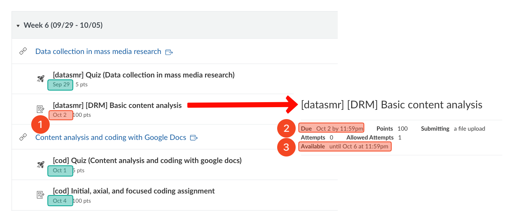

# Welcome to SOC399 (short semester)

<figure><figcaption></figcaption></figure>

## <mark style="color:orange;">Welcome!</mark> 

Welcome to SOC399 - Contemporary Immigration!

My name is Tolga Tezcan, Associate Professor of Sociology, and I'm your instructor. [You can check my CV here](https://docs.google.com/document/d/16HdRvPXse_88mQysbXL6SdoQP2MEhRmX/edit?usp=sharing\&ouid=100179871492576617561\&rtpof=true\&sd=true).

This page will make you familiar with the course, structure, what to expect, and some other important information.

## <mark style="color:orange;">Syllabus</mark> 

[The syllabus is here](https://docs.google.com/document/d/1GchAY7eBQdqIeYfIK1zNzS9aBXTDQd5Q/edit?usp=sharing\&ouid=100179871492576617561\&rtpof=true\&sd=true), also under the "Resources" module of Canvas (The first module).

## <mark style="color:orange;">"\[gr] Getting ready for the class" assignments (Module: Getting ready for the class)</mark> 

There are three assignments to get ready for the class. You can find these assignments under the "Getting ready for the class" module (The second module).

Feel free to submit assignments during the break if you wish. I will grade the assignments in 48 hours during the break.



**\[gr] Google Drive assignment (must be submitted first)** <mark style="color:red;">(due by 12/22 - 11:58 pm)</mark>

* There is a video instruction for this assignment.
* This assignment needs to be submitted first. When graded, you will receive a notification email with feedback. Follow the feedback and resubmit it until you receive full credit within the deadline.&#x20;
* Without getting full credit from the “Google Drive Assignment” (comes with unlimited attempts within the deadline), students cannot continue the course.



**\[gr] Syllabus quiz (must be submitted second)**  <mark style="color:red;">(due by 12/22 - 11:59 pm)</mark>

* No resubmission option. No backtracking. No time limit.



**\[gr] Canvas notification settings assignment (must be submitted third)**  <mark style="color:red;">(due by 12/23 - 11:59 pm)</mark>

* When graded, you will receive a notification email with feedback. Follow the feedback and resubmit it until you receive full credit within the deadline.&#x20;
* DO NOT submit this assignment before getting full credit from the "\[gr] Google Drive assignment (the assignment that must be submitted first)" assignment.



## <mark style="color:orange;">Class structure</mark> 

We have five lectures each week, except the Week 1 which includes three lectures.

Below is a sample overview from a different class, which includes two lectures:

1. Data collection in mass media research
2. Content analysis and coding

Each lecture is accompanied by two assignments (indented items are assignments associated with the specific lecture above):

<figure><figcaption></figcaption></figure>

### <mark style="color:orange;">Where are the readings, slides, and lecture videos?</mark>

Click on the lecture names (see figure above) to see the readings, slides, and lecture videos. See [\[Where are the readings, slides, and lecture videos?\]](https://ttezcan.gitbook.io/lectures/all-lectures-and-labs/guidelines-and-rubrics/where-are-the-readings-slides-and-lecture-videos)

## <mark style="color:orange;">Deadlines</mark> 

<figure><figcaption></figcaption></figure>

1. After the deadline has passed, Canvas will automatically give a zero, but students are granted one (1) additional (flexibility) day to submit their work without a deduction.
2. Once the assignment deadline and the flexibility day has passed, students are granted an additional three-day window to submit their work.&#x20;
   1. <mark style="color:red;">10% deduction</mark> will be applied for the first day of delay after the flexibility day,
   2. <mark style="color:red;">15% deduction</mark> for the second day of delay,
   3. <mark style="color:red;">20% deduction</mark> for the third day of delay. Then the submission window closes.

### <mark style="color:orange;">Where are the due dates?</mark> 

<figure><figcaption></figcaption></figure>

1. The Modules page show each assignment's due date.
2. When you click on the assignment, you see more details, such as "Due" again, and
3. &#x20;"Available until" information:
   1. For this sample assignment, the due date is Oct 2 - 11:59:00pm.
   2. After the deadline has passed, students can submit this assignment by Oct 3 - 11:59:00pm without a deduction <mark style="color:red;">(1 day late; no deduction)</mark>.&#x20;
   3. If submitted by  Oct 4 - 11:59:00pm, the maximum grade could be 90 <mark style="color:red;">(2 days late; 10% deduction)</mark>.&#x20;
   4. If submitted by  Oct 5 - 11:59:00pm, the maximum grade could be 85 <mark style="color:red;">(3 days late; 15% deduction)</mark>.
   5. If submitted by  Oct 6 - 11:59:00pm, the maximum grade could be 80 <mark style="color:red;">(4 days late; 20% deduction)</mark>.&#x20;
   6. Then the submission window closes. Not possible to submit this assignment.

## <mark style="color:orange;">Assignments</mark> 

1. **Lecture assignments (70%)**: Each lecture comes with an assignment.
2. **Lecture quizzes (30%)**: Each lecture comes with a quiz.
   1. **\[Optional] Lecture reflection**: No need to submit a lecture reflection if you're satisfied with your lecture quiz.  Low in-class quizzes can be compensated with a [lecture reflection](https://ttezcan.gitbook.io/lectures/all-lectures-and-labs/guidelines-and-rubrics/lecture-reflections#video-reflection-guidelines).


There will be no exam.


### <mark style="color:orange;">Assignment submissions</mark> 

1. Assignments should not be attached. For this class, students will not download or upload any documents.
2. Assignments should be submitted to Canvas using Google LTI: [\[How to submit an assignment\]](https://ttezcan.gitbook.io/lectures/all-lectures-and-labs/guidelines-and-rubrics/how-to-submit-an-assignment): This link is located at the top of each assignment.

### <mark style="color:orange;">Incorrect submissions</mark>



**Wrong document submission:**&#x20;

* If students submit a wrong document and comment "_submitted a wrong document_" on the Canvas assignment section <mark style="color:red;">before the assignment is graded</mark>, the correct document from their Google Drive week folder will be graded <mark style="color:red;">without deduction</mark>. Assignments revised or created after the due date do not qualify for this option. See "Guidelines and rubrics" <mark style="color:red;">➜</mark> "How to post a comment on an assignment" page on Canvas (the first module called "Resources").
* If no comment is made and the correct document is already in the Google Drive week folder at the time of grading, it will be graded with a 10% deduction, using Google Doc Version History. Assignments revised or created after the due date do not qualify for this option.



**Submission made but no document in the Google Drive weekly subfolder:**

* If submission is made and there is no document in the weekly subfolder, zero will be given and I will contact the student. Upon notification, the student may move the file to the relevant week's subfolder and type "_moved_" in the Canvas comment section of the assignment.&#x20;
  * The assignment will then be graded with a <mark style="color:red;">10% deduction</mark>. Assignments revised or created after this communication do not qualify for this option. See "Guidelines and rubrics" <mark style="color:red;">➜</mark> "How to post a comment on an assignment" page on Canvas (the first module called "Resources").



**Submission made but mistakes detected later:**

* If mistakes are detected after submission and students wish to revise their assignment, they should type “_wait_” in the Canvas comment section before the assignment is graded. Once the corrections are made in the Google Drive class folder, they should add a second comment saying, “_check Google Drive_.” The date of the second comment will be considered the official submission date.
  * This is the main reason why students should review their document before and immediately after submission.



## <mark style="color:orange;">How to work for this class?</mark> 

1. Do the reading and take notes.
2. Review the slides and take notes.
3. Watch the lecture video and take notes.
4. Complete the lecture assignment.
5. Review your notes, then take the lecture quiz.

## <mark style="color:orange;">Late enrollment</mark> 

If you are enrolled late in this class, read the syllabus and the welcoming page that was sent through the announcement (check the very top of class Canvas page) immediately.

As soon as you are enrolled, email me, and I will reasonably adjust the missed deadlines. Start with the assignments under the “Getting ready for the class” module in the order seen on the Canvas module page, then other assignments.

## <mark style="color:orange;">Office hours</mark> 

1. Tuesdays 10:00 – 11:00 AM, online
2. Thursdays, 10:00 – 11:00 AM, online
3. And, by appointment

[Schedule a meeting using this link](https://ttezcan.gitbook.io/lectures/all-lectures-and-labs/guidelines-and-rubrics/office-hours)
