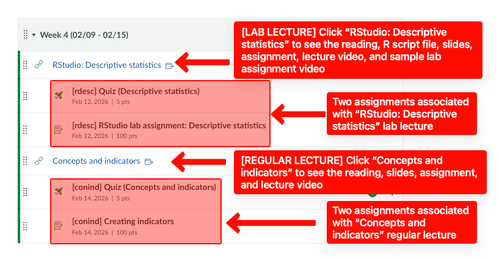

# Welcome to SSCI321-Section 90

<figure><figcaption></figcaption></figure>

## <mark style="color:orange;">Welcome!</mark>

Welcome to SSCI321 - Survey Research!

My name is Tolga Tezcan, associate professor of sociology, and I'm your instructor. [You can check my CV here](https://docs.google.com/document/d/16HdRvPXse_88mQysbXL6SdoQP2MEhRmX/edit?usp=sharing\&ouid=100179871492576617561\&rtpof=true\&sd=true).

This page will make you familiar with the course, structure, what to expect, and some other important information.

## <mark style="color:orange;">Syllabus</mark>

[The syllabus is here](https://docs.google.com/document/d/11xhiYf7Cn2d7OePbxd-rfbWEuAw9ka4J/edit?usp=sharing\&ouid=100179871492576617561\&rtpof=true\&sd=true), also under the "Resources" page of Canvas (The first module).

## <mark style="color:orange;">"Getting ready for the class" module assignments</mark>

There are five assignments to get ready for the class. You can find these assignments under the module named "Getting ready for the class" (The second module).

Feel free to submit assignments during the break if you wish. I will grade the assignments in 48 hours during the break.



**\[gr] Google Drive assignment (must be submitted first)** <mark style="color:red;">(due by 01/21 - 11:57 pm)</mark>

* There is a video instruction for this assignment.
* This assignment needs to be submitted first. When graded, you will receive a notification email with feedback. Follow the feedback and resubmit it until you receive full credit within the deadline.&#x20;
* Without getting full credit from the “Google Drive Assignment” (comes with unlimited attempts within the deadline), students cannot continue the course.



**\[gr] Syllabus quiz** <mark style="color:red;">(due by 01/21 - 11:58 pm)</mark>

* No resubmission option. No backtracking. No time limit.



**\[gr] RStudio lab assignment: Account and packages** <mark style="color:red;">(due by 01/21 - 11:59 pm)</mark>

* There is a video instruction for this assignment.
* This assignment needs to be submitted third. When graded, you will receive a notification email with feedback. Follow the feedback and resubmit it until you receive full credit within the deadline.
* Without receiving full credit from this assignment, students cannot continue the course.



**\[gr] Introduce yourself** <mark style="color:red;">(due by 01/22 - 11:58 pm)</mark>

* When graded, you will receive a notification email with feedback. Follow the feedback and resubmit it until you receive full credit within the deadline.&#x20;



**\[gr] Canvas notification settings assignment** <mark style="color:red;">(due by 01/22 - 11:59 pm)</mark>

* When graded, you will receive a notification email with feedback. Follow the feedback and resubmit it until you receive full credit within the deadline.&#x20;
* DO NOT submit this assignment before getting full credit from the "\[gr] Google Drive assignment (must be submitted first)" assignment.



## <mark style="color:orange;">Deadlines</mark>

<figure><figcaption></figcaption></figure>

1. After the deadline has passed, Canvas will automatically give a zero, but students are granted one (1) additional (flexibility) day to submit their work without a deduction.
2. Once the assignment deadline and the flexibility day has passed, students are granted an additional three-day window to submit their work.&#x20;
   1. <mark style="color:red;">10% deduction</mark> will be applied for the first day of delay after the flexibility day,
   2. <mark style="color:red;">15% deduction</mark> for the second day of delay,
   3. <mark style="color:red;">20% deduction</mark> for the third day of delay. Then the submission window closes.

### <mark style="color:orange;">Where are the due dates?</mark> 

<figure><figcaption></figcaption></figure>

1. The Modules page show each assignment's due date.
2. When you click on the assignment, you see more details, such as "Due" again, and
3. &#x20;"Available until" information:
   1. For this sample assignment, the due date is Oct 2 - 11:59:00pm.
   2. After the deadline has passed, students can submit this assignment by Oct 3 - 11:59:00pm without a deduction <mark style="color:red;">(1 day late; no deduction)</mark>.&#x20;
   3. If submitted by  Oct 4 - 11:59:00pm, the maximum grade could be 90 <mark style="color:red;">(2 days late; 10% deduction)</mark>.&#x20;
   4. If submitted by  Oct 5 - 11:59:00pm, the maximum grade could be 85 <mark style="color:red;">(3 days late; 15% deduction)</mark>.
   5. If submitted by  Oct 6 - 11:59:00pm, the maximum grade could be 80 <mark style="color:red;">(4 days late; 20% deduction)</mark>.&#x20;
   6. Then the submission window closes. Not possible to submit this assignment.

## <mark style="color:orange;">Class structure</mark> 

We have two lectures each week. The first class is lab, the second class is regular lecture.&#x20;

Below is a sample overview, which includes two lectures:

1. RStudio: Descriptive statistics (lab lecture)
2. Concepts and indicators (regular lecture)

Each lecture is accompanied by two assignments (indented items are assignments associated with the specific lecture above):

<figure><figcaption></figcaption></figure>

Click on the lecture names to see the readings, slides, and lecture videos. See [\[Where are the readings, slides, and lecture videos?\]](https://ttezcan.gitbook.io/lectures/all-lectures-and-labs/guidelines-and-rubrics/where-are-the-readings-slides-and-lecture-videos)

<figure><figcaption></figcaption></figure>

## <mark style="color:orange;">Assignments</mark>

### <mark style="color:orange;">**Lecture assignments**</mark>

Each regular lecture comes with an assignment.

### <mark style="color:orange;">Lecture quizzes</mark>

Each lecture (both regular and lab) comes with a quiz.

* **\[Optional] Lecture reflection**: No need to submit a lecture reflection if you're satisfied with your lecture quiz. Low in-class quizzes can be compensated with a [lecture reflection](https://ttezcan.gitbook.io/lectures/all-lectures-and-labs/guidelines-and-rubrics/lecture-reflections#video-reflection-guidelines).

### <mark style="color:orange;">**Lab assignments**</mark>

Each lab lecture comes with a lan assignment. These assignments are to assess their data analysis skills in RStudio. Each lab comes with a lab lecture video and sample lab assignment video.

## <mark style="color:orange;">Exams</mark>

1. Midterm (<mark style="color:red;">03/20 due by 11:59pm</mark> @ online - time limited)
2. Final exam (<mark style="color:red;">05/12 due by 11:59pm</mark> @ online - time limited)

## <mark style="color:orange;">Assignment submissions</mark>

1. Assignments should not be attached. For this class, students will not download or upload any documents.
2. Assignments should be submitted to Canvas using Google LTI: [\[How to submit an assignment\]](https://ttezcan.gitbook.io/lectures/all-lectures-and-labs/guidelines-and-rubrics/how-to-submit-an-assignment): This link is located at the top of each assignment.

## <mark style="color:orange;">Incorrect submissions</mark>



**Wrong document submission:**&#x20;

* If students submit a wrong document and comment "_submitted a wrong document_" on the Canvas assignment section <mark style="color:red;">before the assignment is graded</mark>, the correct document from their Google Drive week folder will be graded <mark style="color:red;">without deduction</mark>. Assignments revised or created after the due date do not qualify for this option. See "Guidelines and rubrics" <mark style="color:red;">➜</mark> "How to post a comment on an assignment" page on Canvas (the first module called "Resources").
* If no comment is made and the correct document is already in the Google Drive week folder at the time of grading, it will be graded with a 10% deduction, using Google Doc Version History. Assignments revised or created after the due date do not qualify for this option.



**Submission made but no document in the Google Drive weekly subfolder:**

If submission is made and there is no document in the weekly subfolder, zero will be given and I will contact the student. Upon notification, the student may move the file to the relevant week's subfolder and type "_moved_" in the Canvas comment section of the assignment.&#x20;

* The assignment will then be graded with a <mark style="color:red;">10% deduction</mark>. Assignments revised or created after this communication do not qualify for this option. See "Guidelines and rubrics" <mark style="color:red;">➜</mark> "How to post a comment on an assignment" page on Canvas (the first module called "Resources").



**Submission made but mistakes detected later:**

If mistakes are detected after submission and students wish to revise their assignment, they should type “_wait_” in the Canvas comment section before the assignment is graded. Once the corrections are made in the Google Drive class folder, they should add a second comment saying, “_check Google Drive_.” The date of the second comment will be considered the official submission date.

* This is the main reason why students should review their document before and immediately after submission.



## <mark style="color:orange;">How to work for this class?</mark>

1. Do the reading and take notes.
2. Review the slides and take notes.
3. Watch the lecture video and take notes.
4. Review your notes, then take the lecture quiz.
5. \[For lab lectures]&#x20;
   1. Upload the specific lab lecture’s R script file to RStudio and watch the lecture video. As you watch, run the codes as shown on the video and take notes.
   2. Watch the sample lab assignment video and take notes.
   3. If you have errors in your previous lab assignments, review the correct code and interpretations that I post as Canvas comments. Paste that code into the specific R script files and run it.
6. Complete the assignment.

## <mark style="color:orange;">Late enrollment</mark>

If you are enrolled late in this class, read the syllabus and the welcoming page that was sent through the announcement (check the very top of class Canvas page) immediately. Since you have missed some classes, you can submit lecture reflections to compensate for missed lecture quizzes.&#x20;

As soon as you are enrolled, email me, and I will reasonably adjust the missed deadlines if you are enrolled after those deadlines. Start with the assignments under the “Getting ready for the class” module (the second module) in the order seen on the Canvas module page, then lecture reflections and other assignments.

## <mark style="color:orange;">Office hours</mark>

1. Monday and Wednesday, 3:30 – 4:30 pm at my office (CAHSS 2306) & before or after my classes. Different in-person and online office hours.
2. And, by appointment

[Schedule a meeting using this link](https://ttezcan.gitbook.io/lectures/all-lectures-and-labs/guidelines-and-rubrics/office-hours)

 
